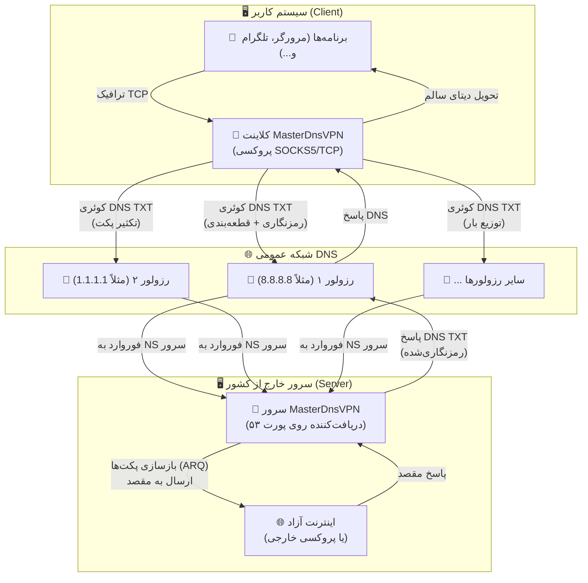
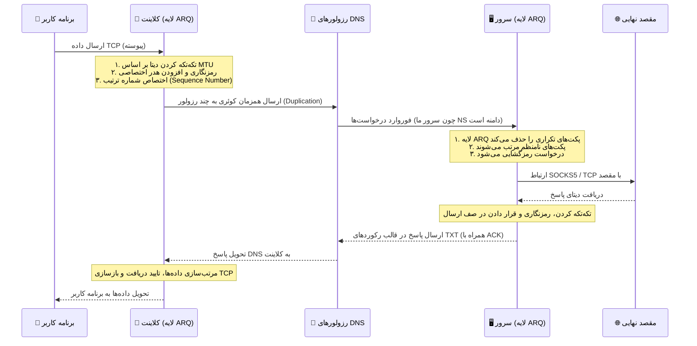

# پروژه MasterDnsVPN 🚀

## [نسخه فارسی](https://github.com/masterking32/MasterDnsVPN/blob/main/README_FA.MD) | [English Version](https://github.com/masterking32/MasterDnsVPN/blob/main/README.MD) | [Spanish Version](https://github.com/masterking32/MasterDnsVPN/blob/main/README_ES.MD)


پروژه **MasterDnsVPN** یک راهکار مقاوم، کم‌سربار و پیشرفته برای دور زدن فیلترینگ و سانسور اینترنت است که ترافیک TCP و پروتکل‌های مبتنی بر آن را به‌صورت بسته‌های رمزنگاری‌شده درون کوئری‌های DNS پنهان و منتقل می‌کند. 

این سامانه به‌طور خاص برای عبور از دیواره‌های آتش (Firewalls) سخت‌گیرانه و شرایطی طراحی شده است که روش‌های سنتی VPN، یا حتی سرویس‌های تونلینگ شناخته‌شده مانند **DNSTT** و **SlipStream** به‌دلیل اختلالات گسترده، محدودیت‌های شدید شبکه‌ای و مسدودسازی رزولورهای DNS دیگر کارآمد نیستند. 

هدف اصلی **MasterDnsVPN**، فراهم کردن تونلی امن، قابل‌اعتماد و انعطاف‌پذیر است که سربار (Overhead) پروتکل را به حداقل رسانده و در شبکه‌های دارای تلفات بسته (Packet Loss) بالا یا محدودیت‌های شدید MTU نیز عملکرد پایدار و قابل قبولی ارائه دهد.

---

## ویژگی‌های کلیدی و مزایا ✨

- **دور زدن سانسور شدید:** 🛡️ طراحی اختصاصی برای افزایش احتمال عبور از فایروال‌ها و سیاست‌های محدودکنندهٔ شبکه که پروتکل‌های VPN معمولی را مسدود می‌کنند.

- **توزیع بار و تعدد رزولورها (Load Balancing):** ⚡ پشتیبانی از چندین DNS Resolver مختلف با استراتژی‌های پیشرفتهٔ متعادل‌سازی بار بسته‌ها (شامل: انتخاب تصادفی، نوبت‌گردشی یا Round-Robin، و انتخاب بهترین رزولور بر اساس کمترین میزان تلفات).

- **تکثیر پکت چند‌مسیره (Packet Duplication):** 📡 قابلیت ارسال همزمان هر پکت از طریق چندین مسیر (رزولور و دامنهٔ مختلف). با این روش، هرکدام از پکت‌ها که زودتر به مقصد برسد پردازش می‌شود و در صورت افتادن (Drop) یک پکت در یک مسیر، همان پکت از طریق رزولور دیگر به‌سلامت می‌رسد. این تکنیک هرچند مصرف پهنای‌باند و منابع را افزایش می‌دهد، اما پایداری و اطمینان از ارسال را در شبکه‌های پر اختلال به‌شدت بالا می‌برد (این قابلیت قابل تنظیم بوده و امکان غیرفعال‌سازی آن نیز وجود دارد).

- **پروتکل ARQ سفارشی و بهینه‌سازی سربار:** 🔄 پیاده‌سازی لایهٔ بازفرست و ترتیب‌دهی بسته‌ها بر بستر UDP/DNS با استفاده از پروتکل اختصاصی ARQ به‌جای استفاده از QUIC. این کار نه‌تنها وابستگی و سربارهای اضافی QUIC را در شبکه‌های به‌شدت محدود حذف می‌کند، بلکه میزان MTU مورد نیاز را کاهش داده و با رزولورهایی که از EDNS پشتیبانی نمی‌کنند یا MTU کمتری دارند نیز کاملاً سازگار است. ساختار پکت‌ها تا حد امکان ساده شده تا کمترین دیتای سربار سمت برنامه تولید شود.

- **امنیت قوی و رمزنگاری انعطاف‌پذیر:** 🔐 پشتیبانی از روش‌های متنوع و قدرتمند رمزگذاری دیتا جهت حفظ امنیت کاربران، از جمله: `XOR`، `ChaCha20`، `AES-128-GCM`، `AES-192-GCM` و `AES-256-GCM`.

- **بررسی خودکار رزولورها و کاوش MTU:** 🧰 در هنگام اجرای برنامه، سیستم به‌صورت خودکار تمامی رزولورها را اسکن و بررسی می‌کند. این قابلیت کیفیت رزولورها را تست کرده، نتایج را به کاربر اطلاع می‌دهد و MTU بهینه را برای مسیرها تعیین می‌کند.

- **مولتی‌پلکس TCP:** 🌐 امکان مولتی‌پلکس کردن (Multiplexing) چندین اتصال محلی TCP بر روی یک نشست (Session) واحد DNS برای مدیریت بهتر منابع.

- **فشرده‌سازی و تجمیع پکت‌های کوچک:** 🗜️ در صورت نیاز و تنظیم توسط کاربر، این ویژگی امکان ادغام پکت‌های کوچک را تا اندازهٔ سقف MTU فراهم می‌کند. این کار باعث کاهش چشمگیر تعداد درخواست‌ها (Requests) شده و فضای مفید بیشتری را برای اطلاعات اصلی اختصاص می‌دهد.

- **بهینه‌سازی اختصاصی SOCKS5:** 🧦 در نسخه‌های جدید، بهینه‌سازی‌های ویژه‌ای برای پروتکل SOCKS5 صورت گرفته است. سیستم به‌صورت خودکار فورواردینگ اطلاعات را بر مبنای ساکس انجام داده و شما را از نصب سرویس‌های جانبی مانند X-UI، Dante و... بی‌نیاز می‌کند. همچنین اگر پروتکل برنامه روی SOCKS5 تنظیم شود، بخش زیادی از سربارها و پکت‌های اضافی مربوط به دست دادن (Handshake) ساکس حذف شده تا حجم درخواست‌ها و ترافیک به حداقل برسد.

- **قابلیت انتقال انواع پروتکل‌های TCP:** 🚀 علاوه بر انتقال بهینه و اختصاصی SOCKS5، شما می‌توانید ترافیک سایر سرویس‌ها نظیر `VLESS`، `ShadowSocks`، `VMESS` و سایر پروتکل‌های مبتنی بر TCP را نیز از طریق این تونل فوروارد و منتقل کنید.

---

لطفاً اگر از این پروژه استفاده می‌کنید یا به آن علاقه‌مند هستید، با دادن ستاره به ریپازیتوری از ما حمایت کنید! ⭐

---

# راه‌اندازی 🧑‍💻

## بخش ۱: پیش‌نیازهای شبکه (پیکربندی DNS) 🛠️

برای اینکه سرور شما بتواند درخواست‌های DNS را به‌طور مستقیم دریافت و پردازش کند، باید مدیریت (Delegation) یک زیردامنه را به سرور اختصاصی خودتان بسپارید. برای این کار، وارد پنل مدیریت DNS دامنهٔ خود (مانند Cloudflare، ArvanCloud و...) شوید و دقیقاً مطابق مراحل زیر دو رکورد ایجاد کنید:

### گام ۱.۱: ساخت رکورد A (معرفی IP سرور) 🅰️
ابتدا باید یک رکورد `A` بسازید تا یک زیردامنه را به آدرس IP عمومی (Public IP) سرورتان متصل کنید.
- **نوع رکورد (Type):** `A`
- **نام (Name):** یک نام کوتاه دلخواه (مثلاً `ns`)
- **آدرس (IPv4 address):** آدرس آی‌پی سرور شما (مثلاً `1.2.3.4`)
  > **نتیجه:** `ns.example.com -> 1.2.3.4`

### گام ۱.۲: ساخت رکورد NS (ارجاع زیردامنهٔ تونل) 🏷️
حالا باید یک رکورد `NS` (Name Server) ایجاد کنید. این رکورد به اینترنت می‌گوید که مسئول پاسخگویی به درخواست‌های این زیردامنه، همان سروری است که در مرحلهٔ قبل معرفی کردید. کلاینت شما از این آدرس برای برقراری ارتباط با تونل استفاده خواهد کرد.
- **نوع رکورد (Type):** `NS`
- **نام (Name):** زیردامنهٔ اصلی تونل (مثلاً `v`)
- **سرور نام (Target/Nameserver):** آدرس رکورد A که در مرحله قبل ساختید (مثلاً `ns.example.com`)
  > **نتیجه:** `v.example.com -> ns.example.com`

---

## بخش ۱.۳: اخطار بسیار مهم (مخصوص کاربران Cloudflare) ⚠️
اگر از پنل کلودفلر استفاده می‌کنید، **باید** وضعیت پروکسی (Proxy status) برای رکورد `A` روی حالت **DNS only (ابر خاکستری ☁️)** تنظیم شده باشد. اگر پروکسی روشن (ابر نارنجی) باشد، کلودفلر ترافیک UDP پورت ۵۳ را مسدود کرده و تونل شما **به‌هیچ‌وجه** کار نخواهد کرد!

## بخش ۱.۴: نکتهٔ طلایی برای افزایش سرعت (MTU) 💡
در پروتکل DNS، طول کاراکترهای دامنه بخشی از حجم محدود هر پکت را اشغال می‌کند. هرچه نام دامنه و زیردامنه‌های شما **کوتاه‌تر** باشند (مثلاً `v.ex.com` به‌جای `tunnel.my-long-domain.com`)، فضای خالی بیشتری برای انتقال داده‌های مفید (Payload) کاربر باقی می‌ماند که مستقیماً باعث افزایش پهنای باند، سرعت بالاتر و کاهش قطعی‌ها می‌شود.

---

## بخش ۲: نصب و راه‌اندازی (کلاینت و سرور) 🚀

شما می‌توانید این پروژه را به دو روش نصب و اجرا کنید. روش اول استفاده از فایل‌های از پیش آماده‌شده و اسکریپت‌های نصب خودکار است (که بسیار سریع‌تر و راحت‌تر است) و روش دوم اجرای مستقیم از روی سورس‌کد می‌باشد.

### گام ۲.۱: نصب و راه‌اندازی سریع سرور لینوکس 🐧

اگر قصد دارید سرور را روی یک سیستم لینوکسی راه‌اندازی کنید، ساده‌ترین راه استفاده از اسکریپت نصب خودکار است. کافی است دستور زیر را در ترمینال سرور وارد کنید:

```bash
curl -sL https://raw.githubusercontent.com/masterking32/MasterDnsVPN/main/server_linux_install.sh | sudo bash
```

این دستور یک اسکریپت را از مخزن گیت‌هاب دانلود کرده و تمام مراحل نصب و تنظیم سرور را به‌صورت خودکار انجام می‌دهد. پس از پایان نصب، سرور اجرا شده و یک **کلید رمزنگاری (Encryption Key)** در لاگ ترمینال به شما نمایش داده می‌شود. این کلید را حتماً کپی کنید (البته این کلید جهت اطمینان در فایلی به نام `encrypt_key.txt` در کنار فایل اجرایی سرور نیز ذخیره می‌شود)، زیرا برای اتصال کلاینت به آن نیاز خواهید داشت.

> ⚠️ **نکتهٔ مهم ۱:** پیش از اجرای این اسکریپت، باید مالکیت یک دامنه را در اختیار داشته باشید و رکوردهای DNS (بخش ۱) را به‌درستی در پنل خود تنظیم کرده باشید.
> 
> ⚠️ **نکتهٔ مهم ۲:** این اسکریپت صرفاً سرور لینوکس را نصب می‌کند و شامل کلاینت نمی‌شود. برای اجرای کلاینت در سیستم شخصی خود، از روش «گام ۲.۲» استفاده کنید.
> 
> ⚠️ **نکتهٔ مهم ۳:** از این دستور می‌توانید برای آپدیت سرور نیز استفاده کنید. با انتشار نسخه‌های جدید، اجرای مجدد این اسکریپت باعث به‌روزرسانی خودکار سرور شما خواهد شد.

---

### گام ۲.۲: استفاده از نسخه‌های کامپایل‌شده کلاینت (روش پیشنهادی ✅)

برای راحتی شما، فایل‌های اجرایی کلاینت (و سرور برای سایر سیستم‌عامل‌ها) از قبل کامپایل شده‌اند. کافی است نسخهٔ مناسب با سیستم‌عامل خود را دانلود کرده و فایل را از حالت فشرده خارج کنید.

> 💡 **نکته:** هر فایل فشرده (ZIP) کلاینت، شامل فایل اجرایی کلاینت و یک فایل تنظیمات پایه به‌نام `client_config.toml` است. 

#### لینک‌های دانلود کلاینت (Client) 📥

| سیستم‌عامل (OS) | پردازنده (Architecture) | مناسب برای سیستم‌های... | لینک دانلود مستقیم |
| :--- | :--- | :--- | :--- |
| ویندوز (Windows) 🪟 | `AMD64` (64-bit) | ویندوز ۱۰ و ۱۱ | [دانلود نسخه ویندوز ⬇️](https://github.com/masterking32/MasterDnsVPN/releases/latest/download/MasterDnsVPN_Client_Windows_AMD64.zip) |
| مک‌اواس (macOS) 🍎 | `ARM64` | مک‌های جدید (سری M1 / M2 / M3) | [دانلود نسخه مک (Apple Silicon) ⬇️](https://github.com/masterking32/MasterDnsVPN/releases/latest/download/MasterDnsVPN_Client_MacOS_ARM64.zip) |
| لینوکس (Linux) 🐧 | `AMD64` (64-bit) | توزیع‌های جدید (اوبونتو ۲۲.۰۴+، دبیان ۱۲+) | [دانلود نسخه لینوکس (جدید) ⬇️](https://github.com/masterking32/MasterDnsVPN/releases/latest/download/MasterDnsVPN_Client_Linux_AMD64.zip) |
| لینوکس (Legacy) 🐧 | `AMD64` (64-bit) | توزیع‌های قدیمی (اوبونتو ۲۰.۰۴، دبیان ۱۱) | [دانلود نسخه لینوکس (سازگاری بالا) ⬇️](https://github.com/masterking32/MasterDnsVPN/releases/latest/download/MasterDnsVPN_Client_Linux-Legacy_AMD64.zip) |
| لینوکس (ARM) 🐧 | `ARM64` | سرورهای ARM، رزبری‌پای و بردهای مشابه | [دانلود نسخه لینوکس (ARM) ⬇️](https://github.com/masterking32/MasterDnsVPN/releases/latest/download/MasterDnsVPN_Client_Linux_ARM64.zip) |

*(کاربران ویندوز و مک، پس از استخراج فایل، می‌توانند مستقیماً به بخش ۳ برای پیکربندی مراجعه کنند).*

#### لینک‌های دانلود سرور (Server) 📤
*(در صورت عدم استفاده از اسکریپت نصب لینوکس)*

| سیستم‌عامل (OS) | پردازنده (Architecture) | مناسب برای سیستم‌های... | لینک دانلود مستقیم |
| :--- | :--- | :--- | :--- |
| ویندوز (Windows) 🪟 | `AMD64` (64-bit) | ویندوز سرور، ویندوز ۱۰ و ۱۱ | [دانلود سرور ویندوز ⬇️](https://github.com/masterking32/MasterDnsVPN/releases/latest/download/MasterDnsVPN_Server_Windows_AMD64.zip) |
| لینوکس (Linux) 🐧 | `AMD64` (64-bit) | سرورهای اوبونتو ۲۲.۰۴+، دبیان ۱۲+ | [دانلود سرور لینوکس (جدید) ⬇️](https://github.com/masterking32/MasterDnsVPN/releases/latest/download/MasterDnsVPN_Server_Linux_AMD64.zip) |
| لینوکس (Legacy) 🐧 | `AMD64` (64-bit) | سرورهای قدیمی (اوبونتو ۲۰.۰۴، دبیان ۱۱) | [دانلود سرور لینوکس (سازگاری بالا) ⬇️](https://github.com/masterking32/MasterDnsVPN/releases/latest/download/MasterDnsVPN_Server_Linux-Legacy_AMD64.zip) |
| لینوکس (ARM) 🐧 | `ARM64` | سرورهای ARM | [دانلود سرور لینوکس (ARM) ⬇️](https://github.com/masterking32/MasterDnsVPN/releases/latest/download/MasterDnsVPN_Server_Linux_ARM64.zip) |
| مک‌اواس (macOS) 🍎 | `ARM64` | مک‌های جدید (سری M1 / M2 / M3) | [دانلود سرور مک (Apple Silicon) ⬇️](https://github.com/masterking32/MasterDnsVPN/releases/latest/download/MasterDnsVPN_Server_MacOS_ARM64.zip) |

---

### گام ۲.۲.۱: آماده‌سازی و اجرا در لینوکس 🗂️

در لینوکس، پس از دانلود فایل ZIP، ابتدا باید ابزارهای استخراج و ویرایشگر متن را نصب کنید (در صورت عدم وجود):

```bash
sudo apt update
sudo apt install unzip nano
```

سپس فایل ZIP را استخراج کنید (نام فایل را بر اساس نسخهٔ دانلودی خود تغییر دهید):

```bash
# استخراج فایل کلاینت (یا سرور)
unzip MasterDnsVPN_Client_Linux_AMD64.zip

# مشاهده لیست فایل‌های استخراج شده
ls
```

در سیستم‌عامل‌های لینوکس و مک، برای اجرای برنامه‌ها باید مجوز اجرا (Execute Permission) به فایل داده شود. نام فایل را بر اساس خروجی دستور `ls` وارد کنید:

```bash
chmod +x MasterDnsVPN_Client_Linux_AMD64
```

اکنون فایل تنظیمات (`client_config.toml` یا `server_config.toml`) را با ویرایشگر `nano` باز کرده و اطلاعات خود را وارد کنید (توضیحات کانفیگ در بخش ۳ آمده است):

```bash
nano client_config.toml
```

> **نکته:** در `nano` برای ذخیره و خروج، کلیدهای `Ctrl + O`، سپس `Enter` و در نهایت `Ctrl + X` را فشار دهید.

پس از اعمال تغییرات، برنامه را با دستور زیر اجرا کنید:

```bash
./MasterDnsVPN_Client_Linux_AMD64
```

---

### گام ۲.۳: نصب و اجرا از طریق سورس‌کد (مخصوص توسعه‌دهندگان 🧑‍💻)

> ⚠️ **توجه:** اگر کاربر معمولی هستید، به این بخش نیازی ندارید. لطفاً از گام ۲.۲ استفاده کرده و مستقیماً به «بخش ۳: پیکربندی» بروید. این بخش مخصوص برنامه‌نویسانی است که قصد تغییر یا اجرای برنامه با پایتون را دارند.

برای اجرای سورس‌کد، باید پایتون نصب باشد. دستورات زیر را در ترمینال اجرا کنید:

```bash
# کلون کردن مخزن پروژه و نصب پیش‌نیازها
git clone https://github.com/masterking32/MasterDnsVPN.git
cd MasterDnsVPN
pip install -r requirements.txt

# کپی کردن فایل‌های نمونه کانفیگ
cp server_config.toml.simple server_config.toml
cp client_config.toml.simple client_config.toml

# اجرای سرور یا کلاینت پس از ویرایش کانفیگ
python server.py
python client.py
```

---

# بخش ۳: ساختار فایل پیکربندی (Config) 🛠️

## بخش ۳.۱: پیکربندی و اجرای سریع کلاینت 🚀

اگر سرور را از طریق اسکریپت نصب سریع (گام ۲.۱) راه‌اندازی کرده‌اید، فقط کافیست فایل `client_config.toml` را در کلاینت ویرایش کنید. سه مقدار اصلی که باید حتماً تنظیم شوند عبارتند از:

1. مقدار **`ENCRYPTION_KEY`**: کلید رمزنگاری که پس از نصب سرور در ترمینال نمایش داده شده (و در فایل `encrypt_key.txt` سرور نیز ذخیره شده است) را اینجا قرار دهید. بدون این کلید اتصال برقرار نمی‌شود!
2. مقدار **`DOMAINS`**: زیردامنهٔ تونل خود را دقیقاً وارد کنید (مثلاً `["v.example.com"]`). **توجه:** در حال حاضر فقط یک دامنه وارد کنید. پشتیبانی از چند دامنه در آپدیت‌های بعدی تکمیل خواهد شد.
3. مقدار **`RESOLVER_DNS_SERVERS`**: لیست سرورهای DNS عمومی جهت ارسال درخواست‌ها (مثلاً `["8.8.8.8", "1.1.1.1"]`).

> ⚠️ **نکتهٔ مهم ۱ (نوع رمزنگاری):** اسکریپت نصب سریع، نوع رمزنگاری سرور را روی `XOR` تنظیم می‌کند. اطمینان حاصل کنید که مقدار `DATA_ENCRYPTION_METHOD` در کلاینت نیز روی `1` تنظیم شده باشد تا با سرور همخوانی داشته باشد.
> 
> ⚠️ **نکتهٔ مهم ۲ (نحوهٔ اتصال):** پروتکل پیش‌فرض `SOCKS5` است. پس از اجرای کلاینت، باید برنامه‌های خود (مثل مرورگر، تلگرام و...) را به پروکسی SOCKS5 با آدرس `127.0.0.1` و پورت تنظیم‌شده (پیش‌فرض: `1080`) متصل کنید. در حالت پیش‌فرض، نام‌کاربری و رمزعبور این پروکسی `master_dns_vpn` است (قابل تغییر در کانفیگ).
> 
> ⚠️ **پشتیبانی:** اگر به مشکلی برخوردید، لطفاً لاگ خطاها را ضمیمه کرده و مشکل خود را منحصراً در بخش [Issues گیت‌هاب](https://github.com/masterking32/MasterDnsVPN/issues) مطرح کنید.

---

## بخش ۳.۲: پیکربندی سرور (در صورت نصب دستی) ⚙️

اگر از اسکریپت گام ۲.۱ استفاده **نکرده‌اید** و قصد دارید سرور را دستی کانفیگ کنید، باید فایل `server_config.toml` را ویرایش کنید. دقت کنید که مقادیر حیاتی مانند نوع رمزنگاری و دامنه باید دقیقاً در سرور و کلاینت **یکسان** باشند.

---

## بخش ۳.۳: راهنمای کامل متغیرهای پیکربندی کلاینت (`client_config.toml`) 📖

در جدول زیر تمامی تنظیمات موجود در کلاینت و کارکرد آن‌ها با جزئیات توضیح داده شده است:

| پارامتر | مقدار پیش‌فرض | مقادیر قابل قبول | توضیحات |
|---------|--------------|------------------|-------|
| `PROTOCOL_TYPE` | `"SOCKS5"` | `"SOCKS5"`, `"TCP"` | **نوع پروتکل تونل:**<br><br>• `"SOCKS5"`:<br> به‌شدت پیشنهاد می‌شود. کدهای ساکس در این پروژه بهینه‌سازی شده‌اند و سرعت بسیار بالاتری دارند.<br>• `"TCP"`:<br> برای انتقال خام پورت‌ها و پروتکل‌هایی نظیر VLESS یا OpenVPN استفاده می‌شود (سربار بیشتری دارد). <br>**توجه**: نوع پروتکل باید با تنظیمات سرور مطابقت داشته باشد. |
| `DOMAINS` | `["v.domain.com"]` | لیست آرایه‌ای (مثلاً `["sub.site.com"]`) | آدرس زیردامنهٔ <br>NS<br> که در بخش ۱ تنظیم کردید. این مقدار باید در کلاینت و سرور کاملاً یکسان باشد. <br> در حال حاضر از ثبت چندین دامنه خودداری کنید!|
| `DATA_ENCRYPTION_METHOD` | `1` | `0` تا `5` | **الگوریتم رمزنگاری:**<br><br>`0`: خاموش (بدون امنیت)<br>`1`: الگوریتم XOR (توصیه شده - سرعت بالا، امنیت متوسط)<br>`2`: ChaCha20<br>`3`: AES-128-GCM<br>`4`: AES-192-GCM<br>`5`: AES-256-GCM (بالاترین امنیت، کمترین سرعت) |
| `ENCRYPTION_KEY` | `""` | رشته متنی (String) | کلید رمزنگاری هماهنگ با سرور. بدون این کلید ارتباط با سرور رد می‌شود. |
| `LISTEN_IP` | `"0.0.0.0"` | IP معتبر (مثلاً `127.0.0.1`) | آدرس IP محلی که کلاینت روی آن سرویس می‌دهد.<br><br>• `"127.0.0.1"`: فقط دستگاه خودتان (امن‌تر)<br>• `"0.0.0.0"`: دسترسی تمام دستگاه‌های متصل به شبکه محلی شما |
| `LISTEN_PORT` | `1080` | شماره پورت (مثلاً `1080`) | پورتی که کلاینت روی آن گوش می‌دهد تا برنامه‌های شما (تلگرام، مرورگر) به آن متصل شوند. |
| `SOCKS5_AUTH` | `true` | `true` یا `false` | فعال‌سازی احراز هویت پروکسی <br>SOCKS5<br> محلی. (اگر <br>`false`<br> باشد، اتصال به پروکسی شما نیازی به یوزر/پسورد ندارد). **نکته:** این تنظیم فقط برای امنیت سیستم خودتان است و ربطی به اتصال به سرور تونل ندارد و فقط در صورتی کار میکند که نوع پروتکل ارتباطی <br>SOCKS5<br> باشد. |
| `SOCKS5_USER` | `"master_dns_vpn"` | رشته متنی دلخواه | نام کاربری برای پروکسی محلی (در صورت فعال بودن `SOCKS5_AUTH`). |
| `SOCKS5_PASS` | `"master_dns_vpn"` | رشته متنی دلخواه | رمز عبور برای پروکسی محلی (در صورت فعال بودن `SOCKS5_AUTH`). |
| `RESOLVER_DNS_SERVERS` | `["8.8.8.8", "1.1.1.1"]` | لیست IP سرورهای DNS | لیست سرورهای عمومی دی ان اس ها (مانند گوگل یا کلودفلر) که ترافیک تونل از طریق آن‌ها ارسال می‌شود. می‌توانید برای پایداری بیشتر، چندین آی پی اضافه کنید، هرچه سرورها بیشتر باشد، ارتباط پایدار تر خواهد بود. |
| `PACKET_DUPLICATION_COUNT` | `3` | عدد صحیح مثبت (مثلاً `1` برای غیرفعال سازی یا `2` یا `3` و بیشتر) | تعداد دفعات تکثیر پکت‌ها. مثلاً عدد `3` یعنی هر بسته به‌طور همزمان به ۳ سرور دی ان اس مختلف ارسال می‌شود تا اولین پاسخی که رسید پذیرفته شود. این کار پهنای‌باند را مصرف می‌کند اما در شبکه‌های پر اختلال، قطعی را به حداقل می‌رساند. |
| `RESOLVER_BALANCING_STRATEGY` | `1` | `1`، `2`، `3` | **استراتژی توزیع بار بین دی ان اس ها:**<br><br>`1`: **تصادفی (Random)**: انتخاب رندوم سرور.<br>`2`: **نوبت‌گردشی (Round-Robin)**: استفاده چرخشی از تمام سرورهای لیست‌شده.<br>`3`: **کمترین‌تلفات (Least Loss)**: انتخاب هوشمند سروری که کمترین قطعی (Packet Loss) را دارد. |
| `MIN_UPLOAD_MTU` | `40` | عدد صحیح (بایت) | حداقل <br>MTU<br> آپلود (بایت) که یک رزولور باید داشته باشد تا انتخاب شود، سرورهایی که <br>MTU<br> آپلود آن‌ها کمتر از این مقدار باشد، حذف می‌شوند. برای غیرفعال کردن این بررسی، مقدار را روی `0` قرار دهید، درباره تنظیمات ام تی‌یو در بخش ۴ بیشتر بخوانید. |
| `MIN_DOWNLOAD_MTU` | `40` | عدد صحیح (بایت) | حداقل <br>MTU<br> دانلود (بایت) که یک رزولور باید داشته باشد تا انتخاب شود، سرورهایی که <br>MTU<br> دانلود آن‌ها کمتر از این مقدار باشد، حذف می‌شوند. برای غیرفعال کردن این بررسی، مقدار را روی `0` قرار دهید، درباره تنظیمات ام تی‌یو در بخش ۴ بیشتر بخوانید. |
| `MAX_UPLOAD_MTU` | `220` | عدد صحیح (بایت) | حداکثر <br>MTU<br> آپلود (بایت) که در کاوش خودکار <br>MTU<br> استفاده می‌شود. این مقدار باید کمتر از بزرگ‌ترین <br>MTU<br> قابل‌اعتماد در شبکه شما باشد. درباره تنظیمات ام تی‌یو در بخش ۴ بیشتر بخوانید. |
| `MTU_TEST_RETRIES` | `2` | عدد صحیح (مثلاً `1` یا `2` یا `3` و بیشتر) | تعداد دفعاتی که کلاینت در صورت شکست در تست <br>MTU<br> آن را تکرار می‌کند. افزایش این مقدار به ۳ یا ۴ برای شبکه‌های بسیار فیلتر شده توصیه می‌شود تا از حذف سرورهایی که موقتا تاخیر دارند جلوگیری شود.<br>**هشدار:** افزایش این مقدار باعث کند شدن قابل توجه زمان راه‌اندازی اولیه و مرحله تست سرور می‌شود، اما دقت را بسیار افزایش می‌دهد. |
| `MTU_TEST_TIMEOUT` | `1.0` | عدد اعشاری (ثانیه) | زمان تایم‌اوت (ثانیه) برای انتظار پاسخ در طول تست <br>MTU<br>. افزایش این مقدار به ۲.۰ یا ۳.۰ در صورت داشتن تاخیر بالا یا تلفات بسته سنگین توصیه می‌شود.<br>**هشدار:** تایم‌اوت بالاتر به معنی زمان راه‌اندازی کندتر در صورت افتادن بسته‌ها است. |
| `MAX_CONNECTION_ATTEMPTS` | `10` | عدد صحیح (مثلاً `10` یا `20` یا `30`) | حداکثر تعداد تلاش‌هایی که کلاینت برای برقراری یک نشست (Session) با سرور انجام می‌دهد. در شبکه‌های بسیار پر اختلال، افزایش این مقدار به ۲۰ یا حتی ۳۰ ممکن است لازم باشد تا از شکست اتصال جلوگیری شود. |
| `ARQ_WINDOW_SIZE` | `3000` | عدد صحیح (مثلاً `300` یا `1000` یا `3000`) | اندازه پنجره  (تعداد بسته‌های بدون تایید که می‌توانند همزمان در جریان باشند). این مقدار باید متناسب با حافظه <br>RAM<br> کلاینت تنظیم شود. برای اکثر کاربران، مقدار ۳۰۰۰ تعادل خوبی بین عملکرد و مصرف منابع ایجاد می‌کند، اما اگر کلاینت شما <br>RAM<br> بسیار کمی دارد، کاهش این مقدار به ۳۰۰ ممکن است ضروری باشد. اما کاهش این مقدار ممکن است باعث قطع و وصل شدن ارتباطات شود.|
| `ARQ_INITIAL_RTO` | `1.0` | عدد اعشاری (ثانیه) | زمان اولیه تایم‌اوت  برای پروتکل <br>ARQ<br>در صورت عدم دریافت تایید برای یک بسته. این مقدار تعیین می‌کند که کلاینت پس از ارسال یک بسته، چقدر منتظر پاسخ بماند قبل از اینکه آن را مجدداً ارسال کند. افزایش این مقدار در شبکه‌های با تاخیر بالا یا تلفات سنگین توصیه می‌شود، اما ممکن است باعث کند شدن واکنش به بسته‌های گمشده شود. |
| `ARQ_MAX_RTO` | `3.0` | عدد اعشاری (ثانیه) | حداکثر زمان قابل افزایش برای ارسال مجدد پکت توسط <br>ARQ<br>. این مقدار تعیین می‌کند که در صورت تکرار نشدن دریافت تایید برای یک بسته، حداکثر چقدر زمان بین تلاش‌های مجدد افزایش یابد. تنظیم این مقدار به ۵.۰ یا حتی ۱۰.۰ در شبکه‌های بسیار پر اختلال ممکن است لازم باشد، اما توجه داشته باشید که مقادیر بسیار بالا ممکن است باعث شود کلاینت برای مدت طولانی منتظر بماند قبل از تلاش مجدد، که می‌تواند تجربه کاربری را تحت تأثیر قرار دهد. |
| `DNS_QUERY_TIMEOUT` | `5.0` | عدد اعشاری (ثانیه) | زمان (ثانیه) برای انتظار پاسخ یک کوئری DNS قبل از اینکه آن را گمشده در نظر گرفته و مجدداً ارسال کند. افزایش این مقدار در شبکه‌های با تاخیر بالا یا تلفات سنگین توصیه می‌شود، اما ممکن است باعث کند شدن واکنش به کوئری‌های گمشده شود. |
| `NUM_RX_WORKERS` | `2` | عدد صحیح (مثلاً `1` یا `2` یا `4`) | تعداد کارگرهای (Workers) دریافت‌کننده (RX) که مسئول پردازش بسته‌های ورودی هستند. افزایش این مقدار می‌تواند در شبکه‌های با ترافیک بالا یا تاخیر زیاد مفید باشد، اما مصرف منابع را نیز افزایش می‌دهد. |
| `NUM_DNS_WORKERS` | `3` | عدد صحیح (مثلاً `1` یا `3` یا `5`) | تعداد کارگرهای (Workers) DNS که مسئول ارسال کوئری‌های DNS و پردازش پاسخ‌ها هستند. افزایش این مقدار می‌تواند در شبکه‌های با ترافیک بالا یا تاخیر زیاد مفید باشد، اما مصرف منابع را نیز افزایش می‌دهد. |
| `SOCKET_BUFFER_SIZE` | `8388608` | عدد صحیح (بایت) | اندازه بافر سوکت UDP. این مقدار تعیین می‌کند که چقدر داده می‌تواند در بافر سوکت ذخیره شود قبل از اینکه سیستم عامل شروع به رد کردن بسته‌ها کند. افزایش این مقدار در شبکه‌های با ترافیک بالا یا تاخیر زیاد توصیه می‌شود، اما توجه داشته باشید که مقادیر بسیار بالا ممکن است باعث مصرف بیش از حد حافظه شود. |
| `LOG_LEVEL` | `"INFO"` | `"DEBUG"`, `"INFO"`, `"WARNING"`, `"ERROR"`, `"CRITICAL"` | سطح لاگ‌گیری برای کلاینت. تنظیم این مقدار به `DEBUG` می‌تواند در هنگام عیب‌یابی مفید باشد، اما ممکن است حجم زیادی از لاگ‌ها را تولید کند. برای استفاده روزمره، `INFO` یا `WARNING` معمولاً کافی است. |

---

## بخش ۳.۴: راهنمای کامل متغیرهای پیکربندی سرور (`server_config.toml`) 📖

| پارامتر | مقدار پیش‌فرض | مقادیر قابل قبول | توضیحات |
|---------|--------------|------------------|-------|
| `UDP_HOST` | `"0.0.0.0"` | IP معتبر (مثلاً `"0.0.0.0"`) | آدرس آی پی که سرور وی پی ان برای دریافت کوئری‌های دی ان اس به آن گوش می‌دهد. |
| `UDP_PORT` | `53` | شماره پورت (مثلاً `53`) | پورتی که سرور وی پی ان برای دریافت کوئری‌های دی ان اس به آن گوش می‌دهد. **توجه:** برای استفاده در محیط‌های واقعی، این پورت باید ۵۳ باشد، زیرا این پروتکل بر اساس دی ان اس کار می‌کند. |
| `DOMAIN` | `["v.domain.com"]` | لیست آرایه‌ای (مثلاً `["sub.site.com"]`) | نام دامنه‌ای که این سرور مسئول پاسخگویی به آن است. این مقدار باید با رکورد <br>NS<br> تنظیم‌شده در پنل دی ان اس شما مطابقت داشته باشد. **درحال حاضر از تنظیم چندین دامنه خودداری کنید!** |
| `DATA_ENCRYPTION_METHOD` | `1` | `0` تا `5` | **الگوریتم رمزنگاری:**<br><br>`0`: خاموش (بدون امنیت)<br>`1`: الگوریتم XOR (توصیه شده - سرعت بالا، امنیت متوسط)<br>`2`: ChaCha20<br>`3`: AES-128-GCM<br>`4`: AES-192-GCM<br>`5`: AES-256-GCM (بالاترین امنیت، کمترین سرعت) <br>**توجه مهم:** این مقدار باید دقیقاً با `DATA_ENCRYPTION_METHOD` تنظیم‌شده در کلاینت مطابقت داشته باشد، در غیر این صورت کلاینت نمی‌تواند به سرور متصل شود. |
| `PROTOCOL_TYPE` | `"SOCKS5"` | `"SOCKS5"` یا `"TCP"` | **نوع پروتکل تونل:**<br><br>• `"SOCKS5"`:<br> به‌شدت پیشنهاد می‌شود. کدهای ساکس در این پروژه بهینه‌سازی شده‌اند و سرعت بسیار بالاتری دارند.<br>• `"TCP"`:<br> برای انتقال خام پورت‌ها و پروتکل‌هایی نظیر VLESS یا OpenVPN استفاده می‌شود (سربار بیشتری دارد). <br>**توجه**: نوع پروتکل باید با تنظیمات کلاینت مطابقت داشته باشد. |
| `USE_EXTERNAL_SOCKS5` | `false` | `true` یا `false` | **استفاده از پروکسی ساکس5 خارجی:**<br><br>• `false`<br> (پروکسی داخلی): سرور پایتون به‌عنوان پروکسی عمل می‌کند و مستقیماً به هدف مورد نظر کلاینت متصل می‌شود (سریع‌ترین و کم‌هزینه‌ترین حالت).<br>• `true`<br> (پروکسی خارجی): سرور به یک پروکسی خارجی (مانند Xray، Tor یا Dante) که روی <br>`FORWARD_IP:FORWARD_PORT`<br> اجرا می‌شود، متصل شده و در صورت فعال بودن <br>`SOCKS5_AUTH`<br> با استفاده از <br>`SOCKS5_USER`<br> و <br>`SOCKS5_PASS`<br> احراز هویت می‌کند. <br>**توصیه شده:** برای بهترین عملکرد و سازگاری، تنظیم <br>`PROTOCOL_TYPE="SOCKS5"`<br> و <br>`USE_EXTERNAL_SOCKS5=false`<br> را پیشنهاد می‌کنیم.<br>**توجه مهم:** اگر `USE_EXTERNAL_SOCKS5` را روی `true` تنظیم کنید، باید مطمئن شوید که پروکسی خارجی شما به‌درستی پیکربندی شده و در دسترس است، در غیر این صورت سرور شما نمی‌تواند به مقصد نهایی متصل شود. شما میتوانید با حالت <br>`TCP`<br> نیز به ساکس خارجی متصل شوید، اما این روش بهینه نیست و ممکن است باعث کاهش سرعت شود. |
| `FORWARD_IP` | `"127.0.0.1"` | IP معتبر (مثلاً `127.0.0.1`) | آدرس آی پی پروکسی خارجی که سرور به آن متصل می‌شود. این مقدار تنها در صورتی استفاده می‌شود که <br>`USE_EXTERNAL_SOCKS5=true`<br> یا <br>`PROTOCOL_TYPE="TCP"`<br> باشد. |
| `FORWARD_PORT` | `1080` | شماره پورت (مثلاً `1080`) | پورتی که پروکسی خارجی روی آن گوش می‌دهد. این مقدار تنها در صورتی استفاده می‌شود که <br>`USE_EXTERNAL_SOCKS5=true`<br> یا <br>`PROTOCOL_TYPE="TCP"`<br> باشد. |
| `SOCKS5_AUTH` | `false` | `true` یا `false` | فعال‌سازی احراز هویت برای پروکسی ساکس5 خارجی. این تنظیم فقط در صورتی استفاده می‌شود که <br>`USE_EXTERNAL_SOCKS5=true`<br> باشد و پروکسی خارجی شما نیاز به احراز هویت داشته باشد. |
| `SOCKS5_USER` | `"admin"` | رشته متنی دلخواه | هویت در پروکسی ساکس5 خارجی (در صورت فعال بودن `SOCKS5_AUTH`). |
| `SOCKS5_PASS` | `"123456"` | رشته متنی دلخواه | رمز عبور برای احراز هویت در پروکسی ساکس5 خارجی (در صورت فعال بودن `SOCKS5_AUTH`). |
| `ARQ_INITIAL_RTO` | `1.0` | عدد اعشاری (ثانیه) | زمان اولیه تایم‌اوت برای پروتکل <br>ARQ<br> در صورت عدم دریافت تایید برای یک بسته. این مقدار تعیین می‌کند که کلاینت پس از ارسال یک بسته، چقدر منتظر پاسخ بماند قبل از اینکه آن را مجدداً ارسال کند. افزایش این مقدار در شبکه‌های با تاخیر بالا یا تلفات سنگین توصیه می‌شود، اما ممکن است باعث کند شدن واکنش به بسته‌های گمشده شود. |
| `ARQ_MAX_RTO` | `3.0` | عدد اعشاری (ثانیه) | حداکثر زمان قابل افزایش برای ارسال مجدد پکت توسط <br>ARQ<br>. این مقدار تعیین می‌کند که در صورت تکرار نشدن دریافت تایید برای یک بسته، حداکثر چقدر زمان بین تلاش‌های مجدد افزایش یابد. تنظیم این مقدار به ۵.۰ یا حتی ۱۰.۰ در شبکه‌های بسیار پر اختلال ممکن است لازم باشد، اما توجه داشته باشید که مقادیر بسیار بالا ممکن است باعث شود کلاینت برای مدت طولانی منتظر بماند قبل از تلاش مجدد، که می‌تواند تجربه کاربری را تحت تأثیر قرار دهد. |
| `ARQ_WINDOW_SIZE` | `3000` | عدد صحیح (مثلاً `300` یا `1000` یا `3000`) | اندازه پنجره  (تعداد بسته‌های بدون تایید که می‌توانند همزمان در جریان باشند). این مقدار باید متناسب با حافظه <br>RAM<br> سرور تنظیم شود. برای اکثر کاربران، مقدار ۳۰۰۰ تعادل خوبی بین عملکرد و مصرف منابع ایجاد می‌کند، اما اگر سرور شما <br>RAM<br> بسیار کمی دارد، کاهش این مقدار به ۳۰۰ ممکن است ضروری باشد. اما کاهش این مقدار ممکن است باعث قطع و وصل شدن ارتباطات شود. |
| `MAX_CONCURRENT_REQUESTS` | `1000` | عدد صحیح (مثلاً `1000` یا `5000`) | حداکثر تعداد درخواست‌های همزمان دی ان اس که سرور می‌تواند پردازش کند. تنظیم این مقدار به ۵۰۰۰ برای سرورهای قوی و ۱۰۰۰ برای ضعیف توصیه می‌شود تا از مصرف بیش از حد حافظه جلوگیری شود. |
| `MAX_PACKETS_PER_BATCH` | `20` | عدد صحیح (مثلاً `1` یا `10` یا `20`) | حداکثر تعداد بسته های کوچکی که میتوانند با هم ادغام شوند، تا درخواست ها کاهش یابد، این مقدار برای سرور بهتر است بین 5 تا 20 باشد، مقدار 1 به این معنی است که  غیرفعال است، و هر بسته به صورت جداگانه پردازش میشود، که ممکن است باعث افزایش مصرف سی پی یو شود، اما در عوض ممکن است تاخیر را کاهش دهد. |
| `SOCKET_BUFFER_SIZE` | `8388608` | عدد صحیح (بایت) | اندازه بافر سوکت UDP. این مقدار تعیین می‌کند که چقدر داده می‌تواند در بافر سوکت ذخیره شود قبل از اینکه سیستم عامل شروع به رد کردن بسته‌ها کند. افزایش این مقدار در شبکه‌های با ترافیک بالا یا تاخیر زیاد توصیه می‌شود، اما توجه داشته باشید که مقادیر بسیار بالا ممکن است باعث مصرف بیش از حد حافظه شود. |
| `LOG_LEVEL` | `"INFO"` | `"DEBUG"`, `"INFO"`, `"WARNING"`, `"ERROR"`, `"CRITICAL"` | سطح لاگ‌گیری برای سرور. تنظیم این مقدار به `DEBUG` می‌تواند در هنگام عیب‌یابی مفید باشد، اما ممکن است حجم زیادی از لاگ‌ها را تولید کند. برای استفاده روزمره، `INFO` یا `WARNING` معمولاً کافی است. |
| `SESSION_TIMEOUT` | `300` | عدد صحیح (ثانیه) | مدت زمان عدم فعالیت (ثانیه) پس از آنکه یک نشست (Session) منقضی در نظر گرفته می‌شود. این مقدار تعیین می‌کند که اگر یک نشست برای مدت زمان مشخصی بدون فعالیت باقی بماند، سرور آن را منقضی شده در نظر گرفته و منابع مربوط به آن را آزاد می‌کند. تنظیم این مقدار به ۳۰۰ ثانیه (۵ دقیقه) معمولاً تعادل خوبی بین حفظ نشست‌های فعال و آزادسازی منابع برای نشست‌های غیرفعال ایجاد می‌کند. |
| `SESSION_CLEANUP_INTERVAL` | `60` | عدد صحیح (ثانیه) | فرکانس (ثانیه) که سرور برای بررسی و حذف نشست‌های منقضی شده استفاده می‌کند. این مقدار تعیین می‌کند که هر چند وقت یکبار سرور به صورت دوره‌ای بررسی کند که کدام نشست‌ها منقضی شده‌اند و منابع مربوط به آن‌ها را آزاد کند. تنظیم این مقدار به ۶۰ ثانیه (۱ دقیقه) معمولاً تعادل خوبی بین عملکرد و مصرف منابع ایجاد می‌کند. |

---

## بخش ۳.۵: درک بهتر از MTU و تنظیمات طلایی برای اجرای سریع ⚠️

### بخش ۳.۵.۱: مفهوم MTU در تونل DNS 📦
کلمه **MTU** مخفف **Maximum Transmission Unit** است و به حداکثر اندازهٔ یک بستهٔ داده (پکت) اشاره دارد که می‌تواند در یک درخواست یا پاسخ شبکه منتقل شود. 
در شبکه‌های فیلترشده یا پر اختلال، اگر بسته‌های داده خیلی بزرگ باشند، احتمال از بین رفتن (Drop) آن‌ها به‌شدت بالا می‌رود. بنابراین، کاهش مقدار MTU می‌تواند پایداری ارتباط را تضمین کند. اما از طرفی، اگر MTU را خیلی پایین تنظیم کنید، اطلاعات به تکه‌های بسیار کوچکی تقسیم می‌شوند که باعث افزایش شدید سربار (Overhead) و در نتیجه افت سرعت خواهد شد.

در پروتکل DNS معمولاً محدودیت‌های شدیدی وجود دارد:
- **آپلود (DNS Query):** محدودیت بسیار شدیدتر است. میانگین MTU مفید برای آپلود، بسته به طول نام دامنهٔ شما، معمولاً بین `۵۰` تا `۲۰۰` بایت است.
- **دانلود (DNS Response):** فضای بیشتری دارد. در حالت عادی بین `۱۰۰` تا `۴۵۰` بایت و اگر ریزالور (Resolver) شما از EDNS پشتیبانی کند، می‌تواند بین `۴۵۰` تا `۴۰۰۰` بایت باشد.

در این پروژه، کلاینت به‌صورت کاملاً هوشمند و با استفاده از الگوریتم *جستجوی باینری (Binary Search)*، حداکثر MTU قابل پشتیبانی برای تک‌تک ریزالورها را تست می‌کند و در نهایت، **کمترین مقدار مشترک (Lowest Common Denominator)** را برای کل ارتباط در نظر می‌گیرد تا ترافیک شما روی هیچ ریزالوری با خطا مواجه نشود.

---

### بخش ۳.۵.۲: آموزش تنظیم بهترین MTU (گام‌به‌گام) 🚀

تست شدن تک‌تک ریزالورها برای پیدا کردن MTU زمان‌بر است. با انجام مراحل زیر می‌توانید بهترین مقادیر را پیدا کرده و سرعت اجرای برنامه را در اجراهای بعدی به شدت کاهش دهید:

#### گام اول: اجرای اولیه و کشف سقف MTU 🕵️‍♂️
پس از راه‌اندازی سرور، کلاینت را با تنظیمات پیش‌فرض اجرا کنید. در همان ثانیه‌های اول اجرا، کلاینت بر اساس طول دامنه و سربار رمزنگاری، حداکثر MTU تئوری را محاسبه کرده و پیامی مشابه زیر نمایش می‌دهد:
```text
Domain: v.example.com -> MIN and MAX_UPLOAD_MTU = 133 | MIN and MAX_DOWNLOAD_MTU = 129
```

به محض دیدن این پیام، برنامه را ببندید! این اعداد سقف تئوری شما هستند.
فایل `client_config.toml` را باز کرده و مقدار `MAX_UPLOAD_MTU` را دقیقاً روی عدد پیشنهادی (مثلاً `133`) تنظیم کنید. این کار باعث می‌شود برنامه در اجراهای بعدی، مقادیر بی‌فایده و بزرگ‌تر از این عدد را تست نکند.

#### گام دوم: تست کامل ریزالورها 🧪

حالا تمام ریزالورهای DNS مورد نظر خود را در فایل کانفیگ وارد کنید و اجازه دهید کلاینت یک‌بار به‌طور کامل اجرا شود. این فرآیند ممکن است کمی طول بکشد؛ صبور باشید تا سیستم تمام ریزالورها را تست کند.
پس از پایان تست، جدولی از تمام ریزالورهای موفق و مقدار MTU آپلود و دانلودِ اختصاصیِ هرکدام به شما نمایش داده می‌شود.

#### گام سوم: تعیین کفِ قابل قبول (فیلتر کردن ریزالورهای ضعیف) 🧹

با بررسی جدول، یک میانگین منطقی پیدا کنید. فرض کنید اکثر ریزالورهای شما آپلود `133` را با موفقیت پاس کرده‌اند، اما چند ریزالور ضعیف فقط آپلود `50` را قبول کرده‌اند.
از آنجایی که سیستم همیشه کمترین MTU را برای کل شبکه در نظر می‌گیرد، وجود آن چند ریزالور ضعیف باعث افت سرعت کل تونل شما می‌شود!
برای حل این مشکل، مقدار `MIN_UPLOAD_MTU` را در فایل کانفیگ روی همان `133` تنظیم کنید. با این کار، کلاینت ریزالورهای ضعیف را به‌طور خودکار حذف کرده و از آن‌ها استفاده نمی‌کند. همین منطق را برای `MIN_DOWNLOAD_MTU` نیز پیاده کنید.

> 💡 نکته: هرچه مقدار MIN را پایین‌تر بیاورید، تعداد ریزالورهای متصل بیشتر می‌شود اما سرعت و کیفیت کلی کاهش می‌یابد. و هرچه MIN بالاتر باشد، کیفیت عالی می‌شود اما ممکن است ریزالورهای کمتری از آن پشتیبانی کنند. شما باید تعادل را پیدا کنید.

### بخش ۳.۵.۳: ترفند طلایی برای اجرای لحظه‌ای (Fast Boot) ⚡

اگر می‌خواهید کلاینت شما در اجراهای بعدی بدون معطلی و در یک چشم‌به‌هم‌زدن اجرا شود و زمان خود را صرف پیدا کردن MTU نکند، تکنیک زیر را به کار ببرید:

مقادیر MIN و MAX را در فایل کانفیگ دقیقاً برابر با هم تنظیم کنید!
مثلاً اگر در تست‌ها متوجه شدید عدد `133` برای آپلود و `129` برای دانلود روی اکثر ریزالورهای شما به‌خوبی کار می‌کند، کانفیگ را این‌گونه تغییر دهید:

```toml
MIN_UPLOAD_MTU = 133
MAX_UPLOAD_MTU = 129

MIN_DOWNLOAD_MTU = 133
MAX_DOWNLOAD_MTU = 129
```

چه اتفاقی می‌افتد؟ الگوریتم جستجوی باینریِ کلاینت متوجه می‌شود که کف و سقف جستجو یکی است؛ بنابراین جستجو را لغو کرده و فقط یک‌بار همان عدد را تست می‌کند. اگر ریزالور جواب داد، تایید می‌شود و اگر جواب نداد، بلافاصله حذف می‌شود. این ترفند سرعت اجرای برنامه را بالا می‌برد!

> ⚠️ شرایط فوق اضطراری: در زمان اختلالات و فیلترینگ بسیار شدید، اگر متوجه شدید ارتباط مکرراً قطع می‌شود، می‌توانید هر دو مقدار MIN و MAX را روی اعداد بسیار پایین (مثلاً ۵۰ یا ۶۰) قفل کنید. سرعت شما در این حالت به‌شدت افت خواهد کرد، اما ارتباطی پایدار و بدون قطعی خواهید داشت که از سدهای محدودکننده عبور می‌کند.

به طور کلی در این پروژه محاسبه MTU و تنظیم مقادیر مناسب خیلی اهمیت دارد و هم سرعت اجرا شدن برنامه و هم پایداری شما را بیشتر می‌کند، پس حتما این بخش را با دقت انجام دهید و بهترین مقادیر را برای شبکه خود پیدا کنید.

---

## بخش ۴: نکات اضطراری و رفع مشکلات 🚨

### بخش ۴.۱: تنظیمات در شرایط قطعی شدید شبکه (اینترنت ملی) ⚠️
زمانی که شبکه به‌طور کامل قطع است، پکت‌لاس (Packet Loss) بسیار بالاست و تنها ترافیک DNS عبور می‌کند، تغییرات زیر را در فایل `client_config.toml` اعمال کنید تا ارتباط شما تضمین شود:

۱. **افزایش تعداد رزولورها:** تا جایی که می‌توانید IP سرورهای دی‌ان‌اس (DNS) عمومی و معتبر را پیدا کرده و به لیست `RESOLVER_DNS_SERVERS` اضافه کنید. استفاده از ترکیب سرورهای مختلف (مثل گوگل `8.8.8.8`، کلودفلر `1.1.1.1`، کوادناین `9.9.9.9` و اوپن‌دی‌ان‌اس `208.67.222.222`) تنوع مسیرها را به حداکثر می‌رساند.

۲. **افزایش تکثیر پکت‌ها (Packet Duplication):** مقدار پارامتر `PACKET_DUPLICATION_COUNT` را افزایش دهید. این متغیر تعیین می‌کند که هر قطعه از اطلاعات شما **به‌طور همزمان** از طریق چند رزولور مختلف ارسال شود. 
- **مثال:** اگر این مقدار را روی `5` تنظیم کنید، کلاینت یک پکت را همزمان به ۵ رزولور می‌فرستد. حتی اگر ۴ مسیر مسدود شده یا پکت را گم کنند، پکت از طریق مسیر پنجم به سرور می‌رسد! سرور با استفاده از لایهٔ ARQ، پکت‌های تکراری را تشخیص داده و دور می‌ریزد تا مشکلی در ترافیک ایجاد نشود.
- **توصیه:** در زمان قطعی شدید، مقادیر بین `3` تا `6` تعادل خوبی ایجاد می‌کنند. توجه داشته باشید که تکثیر بی‌رویه بدون داشتن رزولورهای کافی، باعث فشار مضاعف روی همان چند رزولور و افت کیفیت می‌شود.

### بخش ۴.۲: رفع مشکل اشغال بودن پورت ۵۳ (در سرور لینوکس) 🛑
در اکثر توزیع‌های لینوکس (مانند اوبونتو)، پورت `53` به‌طور پیش‌فرض توسط سرویس `systemd-resolved` اشغال شده است. اگر هنگام اجرای سرور با خطای تداخل پورت مواجه شدید، باید شنوندهٔ پیش‌فرض (Stub Listener) را غیرفعال کنید. دستورات زیر را به‌ترتیب در ترمینال سرور وارد کنید:

۱. فایل تنظیمات را برای ویرایش باز کنید:
```bash
sudo nano /etc/systemd/resolved.conf
```
۲. عبارت `#DNSStubListener=yes` را پیدا کرده، علامت `#` را حذف کنید و مقدار آن را به `no` تغییر دهید (به این شکل: `DNSStubListener=no`). سپس فایل را ذخیره کنید (در نانو: `Ctrl+O` سپس `Enter` و `Ctrl+X`).

۳. سرویس را ری‌استارت کنید تا تغییرات اعمال شود:
```bash
sudo systemctl restart systemd-resolved
```
۴. (اختیاری) در برخی سیستم‌ها برای جلوگیری از اختلال در دسترسی اینترنت خود سرور، لینک نمادین `resolv.conf` را به‌روز کنید:
```bash
sudo ln -sf /run/systemd/resolve/resolv.conf /etc/resolv.conf
```

> ⚠️ **اخطار مهم:** شما نمی‌توانید روی یک سرور، همزمان چند پروژهٔ تونلینگ DNS (مثل DNSTT، SlipStream و MasterDnsVPN) را اجرا کنید! پورت ۵۳ فقط می‌تواند در اختیار یک برنامه باشد. اجرای همزمان آن‌ها باعث اختلال در عملکرد تمامی پروژه‌ها خواهد شد.

---

## بخش ۵: معماری و نحوهٔ کار سیستم 🛠️

پروژه **MasterDnsVPN** با ترکیب یک سیستم مدیریت نشست (Session Multiplexing) و یک لایهٔ اطمینان اختصاصی (ARQ) بر بستر پروتکل UDP/DNS، توانسته محدودیت‌های تونل‌های معمول را دور بزند.

### بخش ۵.۱: نمای کلی معماری دیاگرام 



### بخش ۵.۲: جریان و چرخهٔ حیات پکت‌ها 🔄



### بخش ۵.۳: مفاهیم کلیدی استفاده‌شده 🧠

| مفهوم (Concept) | توضیح کارکرد در سیستم |
| :--- | :--- |
| **نشست (Session)** | یک اتصال کلی بین کلاینت و سرور. هر سرور می‌تواند همزمان ۲۵۵ نشست مستقل را مدیریت کند. |
| **استریم (Stream)** | هر اتصال TCP (مثلاً باز کردن یک سایت جدید) یک استریم محسوب شده که روی یک Session واحد مولتی‌پلکس (Multiplex) می‌شود. |
| **پروتکل ARQ** | جایگزین سبک‌تری برای QUIC. این لایه با استفاده از شماره‌ترتیب (Sequence Number) و تاییدیه (ACK)، بازارسال پکت‌های گم‌شده روی بستر ناپایدار UDP/DNS را تضمین می‌کند. |
| **توزیع بار (Balancing)** | کلاینت با استراتژی‌های تصادفی، نوبت‌گردشی (Round-Robin) یا «کمترین میزان تلفات (Least Loss)» بار ترافیک را بین رزولورها پخش می‌کند. |
| **ادغام تاییدیه‌ها (Packed Control Blocks)** | برای جلوگیری از هدررفت پهنای باند، سرور تاییدیه‌های رسیدن پکت‌ها (ACK) را جمع‌آوری کرده و چندین ACK را در یک بستهٔ کوچک جاسازی می‌کند. |

---

## بخش ۶: نکات فنی پیشرفته ⚙️

- ⚡ **اتصال مستقیم SOCKS5 (Fast-Connect):** در صورتی که در سرور `USE_EXTERNAL_SOCKS5` را روی `false` تنظیم کنید، سرور پایتون به‌طور مستقیم و بدون نیاز به برنامه‌های واسط (مانند Dante یا Xray) ترافیک کلاینت را به مقصد نهایی متصل می‌کند که باعث کاهش شدید تاخیر (Latency) می‌شود.
- 🔄 **پولینگ تطبیقی (Adaptive Polling):** کلاینت دارای سازوکار عقب‌نشینی هوشمند (Ping Manager) است. زمانی که دیتایی برای انتقال وجود نداشته باشد، کلاینت سرعت ارسال درخواست‌های نگه‌دارنده (Keep-Alive) را کاهش می‌دهد تا بار اضافی از روی DNS برداشته شود.
- 🔒 **کتابخانه Cryptography:** برای استفاده از روش‌های رمزنگاری پیشرفته (AES-GCM و ChaCha20) نصب این کتابخانه ضروری است. اما برای دستگاه‌هایی مثل روترها که منابع محدودی دارند، الگوریتم بهینه و اختصاصی `XOR` (روش شماره 1) درون خود برنامه پیاده‌سازی شده و بالاترین سرعت را ارائه می‌دهد.

---

## 🤝 مشارکت (Contributing)
ما از تمام مشارکت‌ها استقبال می‌کنیم! لطفاً در صورت داشتن ایده، رفع باگ یا بهبود عملکرد، پروژه را Fork کرده و تغییرات خود را از طریق Pull Request برای ما ارسال کنید. تمام گزارش‌های مشکل (Bug Reports) را نیز منحصراً در بخش [Issues](https://github.com/masterking32/MasterDnsVPN/issues) مطرح نمایید.

---

## 📄 مجوز (License)
این پروژه تحت مجوز **MIT** منتشر شده است. استفاده، تغییر و توزیع آن با رعایت شرایط مجوز آزاد است. برای جزئیات کامل به فایل `LICENSE` مراجعه کنید.

---

## 👨‍💻 توسعه‌دهنده (Developer)
توسعه‌داده‌شده با ❤️ توسط: [**MasterkinG32**](https://github.com/masterking32)