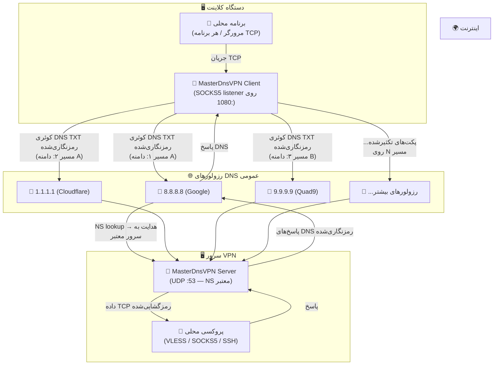
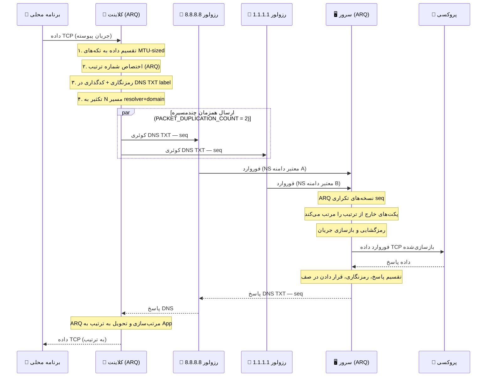

# پروژه MasterDnsVPN 🚀

## [نسخه فارسی](https://github.com/masterking32/MasterDnsVPN/blob/main/README_FA.MD) | [English Version](https://github.com/masterking32/MasterDnsVPN/blob/main/README.MD) | [Spanish Version](https://github.com/masterking32/MasterDnsVPN/blob/main/README_ES.MD)


پروژه **MasterDnsVPN** یک راهکار مقاوم، کم‌سربار و پیشرفته برای دور زدن فیلترینگ و سانسور اینترنت است که ترافیک TCP و پروتکل‌های مبتنی بر آن را به‌صورت بسته‌های رمزنگاری‌شده درون کوئری‌های DNS پنهان و منتقل می‌کند. 

این سامانه به‌طور خاص برای عبور از دیواره‌های آتش (Firewalls) سخت‌گیرانه و شرایطی طراحی شده است که روش‌های سنتی VPN، یا حتی سرویس‌های تونلینگ شناخته‌شده مانند **DNSTT** و **SlipStream** به‌دلیل اختلالات گسترده، محدودیت‌های شدید شبکه‌ای و مسدودسازی رزولورهای DNS دیگر کارآمد نیستند. 

هدف اصلی **MasterDnsVPN**، فراهم کردن تونلی امن، قابل‌اعتماد و انعطاف‌پذیر است که سربار (Overhead) پروتکل را به حداقل رسانده و در شبکه‌های دارای تلفات بسته (Packet Loss) بالا یا محدودیت‌های شدید MTU نیز عملکرد پایدار و قابل قبولی ارائه دهد.

---

## ویژگی‌های کلیدی و مزایا ✨

- **دور زدن سانسور شدید:** 🛡️ طراحی اختصاصی برای افزایش احتمال عبور از فایروال‌ها و سیاست‌های محدودکنندهٔ شبکه که پروتکل‌های VPN معمولی را مسدود می‌کنند.

- **توزیع بار و تعدد رزولورها (Load Balancing):** ⚡ پشتیبانی از چندین DNS Resolver مختلف با استراتژی‌های پیشرفتهٔ متعادل‌سازی بار بسته‌ها (شامل: انتخاب تصادفی، نوبت‌گردشی یا Round-Robin، و انتخاب بهترین رزولور بر اساس کمترین میزان تلفات).

- **تکثیر پکت چند‌مسیره (Packet Duplication):** 📡 قابلیت ارسال همزمان هر پکت از طریق چندین مسیر (رزولور و دامنهٔ مختلف). با این روش، هرکدام از پکت‌ها که زودتر به مقصد برسد پردازش می‌شود و در صورت افتادن (Drop) یک پکت در یک مسیر، همان پکت از طریق رزولور دیگر به‌سلامت می‌رسد. این تکنیک هرچند مصرف پهنای‌باند و منابع را افزایش می‌دهد، اما پایداری و اطمینان از ارسال را در شبکه‌های پر اختلال به‌شدت بالا می‌برد (این قابلیت قابل تنظیم بوده و امکان غیرفعال‌سازی آن نیز وجود دارد).

- **پروتکل ARQ سفارشی و بهینه‌سازی سربار:** 🔄 پیاده‌سازی لایهٔ بازفرست و ترتیب‌دهی بسته‌ها بر بستر UDP/DNS با استفاده از پروتکل اختصاصی ARQ به‌جای استفاده از QUIC. این کار نه‌تنها وابستگی و سربارهای اضافی QUIC را در شبکه‌های به‌شدت محدود حذف می‌کند، بلکه میزان MTU مورد نیاز را کاهش داده و با رزولورهایی که از EDNS پشتیبانی نمی‌کنند یا MTU کمتری دارند نیز کاملاً سازگار است. ساختار پکت‌ها تا حد امکان ساده شده تا کمترین دیتای سربار سمت برنامه تولید شود.

- **امنیت قوی و رمزنگاری انعطاف‌پذیر:** 🔐 پشتیبانی از روش‌های متنوع و قدرتمند رمزگذاری دیتا جهت حفظ امنیت کاربران، از جمله: `XOR`، `ChaCha20`، `AES-128-GCM`، `AES-192-GCM` و `AES-256-GCM`.

- **بررسی خودکار رزولورها و کاوش MTU:** 🧰 در هنگام اجرای برنامه، سیستم به‌صورت خودکار تمامی رزولورها را اسکن و بررسی می‌کند. این قابلیت کیفیت رزولورها را تست کرده، نتایج را به کاربر اطلاع می‌دهد و MTU بهینه را برای مسیرها تعیین می‌کند.

- **مولتی‌پلکس TCP:** 🌐 امکان مولتی‌پلکس کردن (Multiplexing) چندین اتصال محلی TCP بر روی یک نشست (Session) واحد DNS برای مدیریت بهتر منابع.

- **فشرده‌سازی و تجمیع پکت‌های کوچک:** 🗜️ در صورت نیاز و تنظیم توسط کاربر، این ویژگی امکان ادغام پکت‌های کوچک را تا اندازهٔ سقف MTU فراهم می‌کند. این کار باعث کاهش چشمگیر تعداد درخواست‌ها (Requests) شده و فضای مفید بیشتری را برای اطلاعات اصلی اختصاص می‌دهد.

- **بهینه‌سازی اختصاصی SOCKS5:** 🧦 در نسخه‌های جدید، بهینه‌سازی‌های ویژه‌ای برای پروتکل SOCKS5 صورت گرفته است. سیستم به‌صورت خودکار فورواردینگ اطلاعات را بر مبنای ساکس انجام داده و شما را از نصب سرویس‌های جانبی مانند X-UI، Dante و... بی‌نیاز می‌کند. همچنین اگر پروتکل برنامه روی SOCKS5 تنظیم شود، بخش زیادی از سربارها و پکت‌های اضافی مربوط به دست دادن (Handshake) ساکس حذف شده تا حجم درخواست‌ها و ترافیک به حداقل برسد.

- **قابلیت انتقال انواع پروتکل‌های TCP:** 🚀 علاوه بر انتقال بهینه و اختصاصی SOCKS5، شما می‌توانید ترافیک سایر سرویس‌ها نظیر `VLESS`، `ShadowSocks`، `VMESS` و سایر پروتکل‌های مبتنی بر TCP را نیز از طریق این تونل فوروارد و منتقل کنید.

---

لطفاً اگر از این پروژه استفاده می‌کنید یا به آن علاقه‌مند هستید، با دادن ستاره به ریپازیتوری از ما حمایت کنید! ⭐

---

# راه‌اندازی 🧑‍💻

## بخش ۱: پیش‌نیازهای شبکه (پیکربندی DNS) 🛠️

برای اینکه سرور شما بتواند درخواست‌های DNS را به‌طور مستقیم دریافت و پردازش کند، باید مدیریت (Delegation) یک زیردامنه را به سرور اختصاصی خودتان بسپارید. برای این کار، وارد پنل مدیریت DNS دامنهٔ خود (مانند Cloudflare، ArvanCloud و...) شوید و دقیقاً مطابق مراحل زیر دو رکورد ایجاد کنید:

### گام ۱.۱: ساخت رکورد A (معرفی IP سرور) 🅰️
ابتدا باید یک رکورد `A` بسازید تا یک زیردامنه را به آدرس IP عمومی (Public IP) سرورتان متصل کنید.
- **نوع رکورد (Type):** `A`
- **نام (Name):** یک نام کوتاه دلخواه (مثلاً `ns`)
- **آدرس (IPv4 address):** آدرس آی‌پی سرور شما (مثلاً `1.2.3.4`)
  > **نتیجه:** `ns.example.com -> 1.2.3.4`

### گام ۱.۲: ساخت رکورد NS (ارجاع زیردامنهٔ تونل) 🏷️
حالا باید یک رکورد `NS` (Name Server) ایجاد کنید. این رکورد به اینترنت می‌گوید که مسئول پاسخگویی به درخواست‌های این زیردامنه، همان سروری است که در مرحلهٔ قبل معرفی کردید. کلاینت شما از این آدرس برای برقراری ارتباط با تونل استفاده خواهد کرد.
- **نوع رکورد (Type):** `NS`
- **نام (Name):** زیردامنهٔ اصلی تونل (مثلاً `v`)
- **سرور نام (Target/Nameserver):** آدرس رکورد A که در مرحله قبل ساختید (مثلاً `ns.example.com`)
  > **نتیجه:** `v.example.com -> ns.example.com`

---

## بخش ۱.۳: اخطار بسیار مهم (مخصوص کاربران Cloudflare) ⚠️
اگر از پنل کلودفلر استفاده می‌کنید، **باید** وضعیت پروکسی (Proxy status) برای رکورد `A` روی حالت **DNS only (ابر خاکستری ☁️)** تنظیم شده باشد. اگر پروکسی روشن (ابر نارنجی) باشد، کلودفلر ترافیک UDP پورت ۵۳ را مسدود کرده و تونل شما **به‌هیچ‌وجه** کار نخواهد کرد!

## بخش ۱.۴: نکتهٔ طلایی برای افزایش سرعت (MTU) 💡
در پروتکل DNS، طول کاراکترهای دامنه بخشی از حجم محدود هر پکت را اشغال می‌کند. هرچه نام دامنه و زیردامنه‌های شما **کوتاه‌تر** باشند (مثلاً `v.ex.com` به‌جای `tunnel.my-long-domain.com`)، فضای خالی بیشتری برای انتقال داده‌های مفید (Payload) کاربر باقی می‌ماند که مستقیماً باعث افزایش پهنای باند، سرعت بالاتر و کاهش قطعی‌ها می‌شود.

---

## بخش ۲: نصب و راه‌اندازی (کلاینت و سرور) 🚀

شما می‌توانید این پروژه را به دو روش نصب و اجرا کنید. روش اول استفاده از فایل‌های از پیش آماده شده است (که بسیار سریع‌تر و راحت‌تر است) و روش دوم اجرای مستقیم از روی سورس‌کد است.

### گام ۲.۱: نصب و راه اندازی سریع سرور لینوکس

اگر قصد دارید سرور را روی یک سیستم لینوکسی راه‌اندازی کنید، کافی است دستور زیر را در ترمینال وارد کنید:

```bash
curl -sL https://raw.githubusercontent.com/masterking32/MasterDnsVPN/main/server_linux_install.sh | sudo bash
```
این دستور یک اسکریپت نصب را از مخزن گیت‌هاب دانلود و اجرا می‌کند که به‌صورت خودکار سرور را روی لینوکس نصب و تنظیم می‌کند. پس از اجرای این دستور، سرور به‌طور خودکار راه‌اندازی شده و کلید رمزنگاری تولید شده در لاگ سرور نمایش داده خواهد شد. این کلید را کپی کرده و در تنظیمات کلاینت قرار دهید تا بتوانید کلاینت را نیز راه‌اندازی کنید.

 
> ⚠️ **نکته مهم ۱:** توجه داشته باشید قبل از اجرای این دستور دامنه خود را باید ساخته و رکوردهای DNS را تنظیم کرده باشید (بخش ۱ را کامل انجام داده باشید).

> ⚠️ **نکته مهم ۲:** این اسکریپت فقط برای سرور لینوکس است و کلاینت را شامل نمی‌شود. برای نصب کلاینت، لطفاً از روش گام ۲.۲ استفاده کنید که در ادامه توضیح داده شده است.

> ⚠️ **نکته مهم ۳:** شما میتوانید از این دستور برای آپدیت سرور نیز استفاده کنید. هر زمان که نسخه جدیدی منتشر شد، با اجرای مجدد این دستور، سرور شما به‌صورت خودکار به آخرین نسخه آپدیت خواهد شد.

### گام ۲.۲: استفاده از نسخه‌های کامپایل‌شده (روش پیشنهادی ✅)
برای راحتی هرچه بیشتر شما، فایل‌های اجرایی از قبل کامپایل‌شده برای سیستم‌عامل‌ها و معماری‌های مختلف آماده شده‌اند. کافی است نسخهٔ مناسب با سیستم‌عامل خود را دانلود کرده و فایل را از حالت فشرده خارج کنید.

> **نکتهٔ مهم:** 💡 هر فایل فشرده (ZIP) کلاینت، شامل فایل اجرایی کلاینت و یک فایل قالب به‌نام `client_config.toml` است. به همین ترتیب، فایل‌های سرور نیز شامل فایل اجرایی سرور و قالب `server_config.toml` هستند.

#### لینک‌های دانلود کلاینت (Client) 📥

| سیستم‌عامل (OS) | پردازنده (Architecture) | مناسب برای سیستم‌های... | لینک دانلود مستقیم |
| :--- | :--- | :--- | :--- |
| ویندوز (Windows) 🪟 | `AMD64` (64-bit) | ویندوز ۱۰ و ۱۱ | [دانلود نسخه ویندوز ⬇️](https://github.com/masterking32/MasterDnsVPN/releases/latest/download/MasterDnsVPN_Client_Windows_AMD64.zip) |
| مک‌اواس (macOS) 🍎 | `ARM64` | مک‌های جدید (سری M1 / M2 / M3) | [دانلود نسخه مک (Apple Silicon) ⬇️](https://github.com/masterking32/MasterDnsVPN/releases/latest/download/MasterDnsVPN_Client_MacOS_ARM64.zip) |
| لینوکس (Linux) 🐧 | `AMD64` (64-bit) | توزیع‌های جدید (اوبونتو ۲۲.۰۴+، دبیان ۱۲+) | [دانلود نسخه لینوکس (جدید) ⬇️](https://github.com/masterking32/MasterDnsVPN/releases/latest/download/MasterDnsVPN_Client_Linux_AMD64.zip) |
| لینوکس (Legacy) 🐧 | `AMD64` (64-bit) | توزیع‌های قدیمی (اوبونتو ۲۰.۰۴، دبیان ۱۱) | [دانلود نسخه لینوکس (سازگاری بالا) ⬇️](https://github.com/masterking32/MasterDnsVPN/releases/latest/download/MasterDnsVPN_Client_Linux-Legacy_AMD64.zip) |
| لینوکس (ARM) 🐧 | `ARM64` | سرورهای ARM، رزبری‌پای و بردهای مشابه | [دانلود نسخه لینوکس (ARM) ⬇️](https://github.com/masterking32/MasterDnsVPN/releases/latest/download/MasterDnsVPN_Client_Linux_ARM64.zip) |

برای اجرای کلاینت پس از خارج کردن آن از حالت فشرده میتوانید مستقیم به مرحله ۳.۱ (پیکربندی و اجرای کلاینت) بروید.

#### لینک‌های دانلود سرور (Server) 📤

| سیستم‌عامل (OS) | پردازنده (Architecture) | مناسب برای سیستم‌های... | لینک دانلود مستقیم |
| :--- | :--- | :--- | :--- |
| ویندوز (Windows) 🪟 | `AMD64` (64-bit) | ویندوز سرور، ویندوز ۱۰ و ۱۱ | [دانلود سرور ویندوز ⬇️](https://github.com/masterking32/MasterDnsVPN/releases/latest/download/MasterDnsVPN_Server_Windows_AMD64.zip) |
| لینوکس (Linux) 🐧 | `AMD64` (64-bit) | سرورهای اوبونتو ۲۲.۰۴+، دبیان ۱۲+ | [دانلود سرور لینوکس (جدید) ⬇️](https://github.com/masterking32/MasterDnsVPN/releases/latest/download/MasterDnsVPN_Server_Linux_AMD64.zip) |
| لینوکس (Legacy) 🐧 | `AMD64` (64-bit) | سرورهای قدیمی (اوبونتو ۲۰.۰۴، دبیان ۱۱) | [دانلود سرور لینوکس (سازگاری بالا) ⬇️](https://github.com/masterking32/MasterDnsVPN/releases/latest/download/MasterDnsVPN_Server_Linux-Legacy_AMD64.zip) |
| لینوکس (ARM) 🐧 | `ARM64` | سرورهای ARM | [دانلود سرور لینوکس (ARM) ⬇️](https://github.com/masterking32/MasterDnsVPN/releases/latest/download/MasterDnsVPN_Server_Linux_ARM64.zip) |
| مک‌اواس (macOS) 🍎 | `ARM64` | مک‌های جدید (سری M1 / M2 / M3) | [دانلود سرور مک (Apple Silicon) ⬇️](https://github.com/masterking32/MasterDnsVPN/releases/latest/download/MasterDnsVPN_Server_MacOS_ARM64.zip) |

---

### گام ۲.۲.۱: استخراج فایل‌ها و آماده‌سازی برای اجرا در لینوکس🗂️

پس از دانلود فایل ZIP مناسب با سیستم‌عامل خود، باید آن را از حالت فشرده خارج کنید تا به فایل اجرایی و فایل تنظیمات (`.toml`) دسترسی پیدا کنید. 
*(در ویندوز و مک، کافیست روی فایل دانلود شده راست‌کلیک کرده و گزینه Extract را انتخاب کنید).*

**راهنمای مخصوص کاربران لینوکس:**
در لینوکس ابتدا برنامه `unzip` و ویرایشگر `nano` را نصب کنید (اگر از قبل نصب نیستند):
```bash
sudo apt update
sudo apt install unzip nano
```

سپس فایل ZIP دانلود شده را استخراج کنید (نام فایل را بر اساس نسخهٔ دانلودی خود تغییر دهید):
```bash
# استخراج فایل سرور (برای کلاینت نام فایل را تغییر دهید)
unzip MasterDnsVPN_Server_Linux_AMD64.zip

# مشاهده لیست فایل‌های استخراج شده
ls
```

در سیستم‌عامل‌های لینوکس و مک، برای اجرای برنامه‌ها باید ابتدا **مجوز اجرا (Execute Permission)** را به فایل بدهید. اسم فایل را بر اساس خروجی دستور `ls` و چیزی که استخراج شده است تنظیم کنید:
```bash
chmod +x MasterDnsVPN_Server_Linux_AMD64
```

اکنون فایل تنظیمات (`server_config.toml` یا `client_config.toml`) را با ویرایشگر `nano` باز کرده و اطلاعات خود را وارد کنید (توضیحات کانفیگ در بخش‌های بعدی آمده است):
```bash
# ویرایش تنظیمات سرور
nano server_config.toml

# یا برای ویرایش تنظیمات کلاینت
nano client_config.toml
```
> **نکته:** پس از وارد کردن تنظیمات، فایل را ذخیره کرده و خارج شوید (در `nano` کلیدهای ترکیبی `Ctrl + O` سپس `Enter` و در نهایت `Ctrl + X` را بزنید).

پس از اعمال تغییرات در فایل کانفیگ، می‌توانید برنامه را اجرا کنید:
```bash
# اجرای فایل سرور
./MasterDnsVPN_Server_Linux_AMD64

# یا اجرای فایل کلاینت
./MasterDnsVPN_Client_Linux_AMD64
```
> ⚠️ **اخطار:** نام فایل اجرایی ممکن است بسته به سیستم‌عامل و نسخه برنامه متفاوت باشد، پس حتماً با دستور `ls` نام دقیق را بررسی کنید.

برای ادامه روند به بخش ۳ (پیکربندی و اجرا) بروید.

---

### گام ۲.۳: نصب و اجرا از طریق سورس‌کد پایتون (مخصوص توسعه‌دهندگان 🧑‍💻)

> ⚠️ **نکته مهم:** شما اگر کاربر معمولی هستید نیازی به مطالعه این بخش ندارید، این بخش مخصوص برنامه‌نویسان و توسعه‌دهندگانی است که می‌خواهند مستقیماً از روی سورس‌کد برنامه را اجرا کنند یا در آن تغییراتی ایجاد کنند. اگر فقط می‌خواهید از برنامه استفاده کنید، لطفاً از روش گام ۲.۲ استفاده کنید که بسیار ساده‌تر و سریع‌تر است و مستقیما به بخش ۳. پیکربندی و اجرا بروید.

اگر ترجیح می‌دهید برنامه را مستقیماً از روی سورس‌کد اجرا کنید (این روش نیازمند نصب بودن پایتون روی سیستم شماست)، ترمینال یا خط فرمان خود را باز کرده و دستورات زیر را به‌ترتیب وارد کنید:

ابتدا مخزن پروژه را کلون کرده، وارد پوشهٔ آن شوید و وابستگی‌های مورد نیاز را نصب کنید:
```bash
git clone https://github.com/masterking32/MasterDnsVPN.git
cd MasterDnsVPN
pip install -r requirements.txt
```

سپس فایل‌های نمونهٔ کانفیگ را کپی کنید تا فایل‌های اصلی ایجاد شوند:
```bash
cp server_config.toml.simple server_config.toml
cp client_config.toml.simple client_config.toml
```

پس از ویرایش فایل‌های کانفیگ (با `nano` یا هر ویرایشگر دیگر)، سرور یا کلاینت را اجرا کنید:
```bash
# اجرای سرور
python server.py

# اجرای کلاینت
python client.py
```

# گام ۳ ساختار فایل پیکربندی

## بخش ۳.۱: پیکربندی و اجرای سریع کلاینت

اگر فقط می‌خواهید کلاینت را راه‌اندازی کنید و سرور را روی یک سرور لینوکسی با استفاده از اسکریپت نصب سریع (گام ۲.۱) راه‌اندازی کرده‌اید، کافی است فایل `client_config.toml` را مطابق با تنظیمات سرور و رکوردهای DNS خودتان ویرایش کنید.

در این فایل، مقادیر زیر را تنظیم کنید:
- مقدار `ENCRYPTION_KEY`: کلیدی که سرور در لاگ نمایش داده است (یا در فایل `encrypt_key.txt` ذخیره شده است).
- مقدار `DOMAINS`: زیردامنهٔ تونل شما (مثلاً `[ "v.example.com" ]`).
- مقدار `RESOLVER_DNS_SERVERS`: لیست رزولورهای عمومی DNS (مثلاً `[ "8.8.8.8", "8.8.4.4", "1.1.1.1", "1.0.0.1" ]`).

با تنظیم و ذخیره این مقادیر، فایل `client_config.toml` را در **همان پوشه** فایل اجرایی کلاینت قرار داده و برنامه را اجرا کنید.

> ⚠️ **نکته مهم ۱:** اگر سرور را با استفاده از اسکریپت نصب سریع راه‌اندازی کرده‌اید، حتماً کلید رمزنگاری تولید شده در لاگ سرور را کپی کرده و در فیلد `ENCRYPTION_KEY` کلاینت قرار دهید. بدون این کلید، کلاینت نمی‌تواند با سرور ارتباط برقرار کند. اگر فایل `encrypt_key.txt` در کنار فایل اجرایی سرور وجود دارد، می‌توانید کلید را از آنجا نیز کپی کنید.

> ⚠️ **نکته مهم ۲:** نوع رمزنگاری پیش فرض سرور در صورت نصب با اسکریپت نصب سریع، `XOR` است، پس مطمئن شوید که مقدار `DATA_ENCRYPTION_METHOD` در فایل کانفیگ کلاینت نیز روی `1` تنظیم شده باشد تا با سرور سازگار باشد، در صورت تغییر این مقدار در سرور، حتماً آن را در کلاینت نیز به‌روزرسانی کنید.

> ⚠️ **نکته مهم ۳:** در حال حاضر برنامه از چندین دامنه پشتیبانی نمیکند، بنابراین در فیلد `DOMAINS` فقط یک دامنه وارد کنید، در صورت نیاز به استفاده از چندین دامنه لطفاً منتظر آپدیت‌های بعدی باشید که این قابلیت به‌طور کامل و بدون مشکل اضافه خواهد شد.

> ⚠️ **نکته مهم ۴:** اگر سرور را با استفاده از اسکریپت نصب سریع راه‌اندازی کرده‌اید، پروتکل پیشفرض `SOCKS5` میباشد، و شما میتوانید با کلاینت ساکس به آی پی سیستم کلاینت با پورت ثبت شده در فیلد `LISTEN_PORT` اتصال را برقرار کنید، در حالت پیش فرض این پورت `1080` است، و همچنین نام کاربری و رمزعبور برای ورود اجباریست که هر دو `master_dns_vpn` می باشد که میتوانید آن ها را با ویرایش فایل کانفیگ کلاینت ویرایش یا غیرفعال کنید.

> ⚠️ **نکته مهم پایانی:** توصیه میکنیم بخش ساختار فایل پیکر بندی کلاینت را نیز مطالعه کنید، همچنین توضیحات مربوط به بخش تنظیمات MTU رو نیز مطالعه کنید، اگر مشکل دیگری داشتید، بخش رفع مشکل را مطالعه کنید و اگر مشکل شما حل نشد میتوانید از بخش [Issues](https://github.com/masterking32/MasterDnsVPN/issues) مشکل خود را با ارائه لاگ و توضیحات کامل مطرح کنید تا در سریع‌ترین زمان ممکن به آن پاسخ داده شود. (از ارسال پیام در پلتفرم های دیگر به توسعه دهندگان خودداری کنید، تنها راه پشتیبانی این پروژه، فقط از بخش Issue های گیت هاب می باشد.)

## بخش ۳.۲: پیکربندی و اجرای سرور 

اگر میخواهید نصب سرور را روی لینوکس انجام دهید پیشنهاد ما استفاده از اسکریپت نصب سریع (گام ۲.۱) میباشد که بسیار راحت و سریع است، اما اگر میخواهید سرور را مستقیما از روی سورس و یا با استفاده از فایل‌های اجرایی راه‌اندازی کنید، میتوانید طبق مراحل زیر پیش بروید.

به نسبت نوع اجرا ابتدا گام ۲.۲.۱ و یا ۲.۳ را مطالعه کنید و فایل‌های اجرایی یا سورس‌کد را آماده کنید، برای نسخه سرور در ویندوز فقط کافیست فایل فشرده را دانلود و آن را از حالت فشرده خارج کنید.

سپس بخش ساختار فایل های پیکربندی کلاینت و سرور را در بخش های بعدی مطالعه کنید و فایل‌های کانفیگ را مطابق با تنظیمات سرور و رکوردهای DNS خودتان ویرایش کنید و سپس برنامه را اجرا کنید.

> ⚠️ **نکته مهم:** برای کاربران معمولی پیشنهاد ما استفاده از سرور لینوکس و اجرای آن با استفاده از اسکریپت نصب سریع (گام ۲.۱) میباشد که بسیار راحت و سریع است، نصب دستی و پیکربندی آن ممکن است برای کاربران معمولی دشوار باشد، اما اگر شما یک توسعه‌دهنده یا برنامه‌نویس هستید و می‌خواهید سرور را مستقیماً از روی سورس‌کد اجرا کنید یا در آن تغییراتی ایجاد کنید، روش گام ۲.۳ مناسب شماست.

## بخش ۳.۳: ساختار فایل‌های پیکربندی (Config) 🛠

️در این بخش توضیحات کامل و جامعی در مورد ساختار فایل‌های پیکربندی سرور و کلاینت ارائه شده است. این توضیحات شامل تمامی پارامترهای قابل تنظیم، مقادیر پیش‌فرض، و راهنمایی‌های لازم برای تنظیم صحیح هر پارامتر می‌باشد.

### بخش ۳.۳.۱: فایل پیکربندی کلاینت (client_config.toml)


| پارامتر | مقدار پیش‌فرض | مقادیر قابل قبول | توضیح |
|---------|--------------|------------------|-------|
| `PROTOCOL_TYPE` | `"SOCKS5"` | `"SOCKS5"`، `"TCP"` | نوع پروتکل تونل:<br>`SOCKS5`:<br>ما ساکس را برای این سیستم بهینه کردیم، تا سرعت بالاتری داشته باشد<br>استفاده از این گزینه به جای حالت تی سی پی به شدت پیشنهاد میشود و باعث افزایش سرعت میشود.<br>`"TCP"`: درصورتی که میخواهید یک پورت یا پروتکل دیگر را تانل کنید مثل <br>`VLESS, VMESS, SHADOWSOCKS,OpenVPN `و ...<BR>میتوانید از این حالت استفاده کنید.<br>با توجه به سربارهای زیاد این پروتکل ها برای دی ان اس، پیشنهاد ما استفاده از ساکس5 می باشد که بهینه سازی نیز شده است.<br>**نکته مهم:** نوع ارتباط کلاینت باید با سرور یکی باشد.|
| `DOMAINS` | `["t.example.com"]` | دامنه در ساختار `["v.domain.com"]` | آدرس NS دامنه ای که ثبت کردید.<br>این مقدار باید با مقدار داخل سرور یکسان باشد.<br>**نکته مهم:** درحال حاضر از قراردادن چندین دامنه خودداری کنید.|
| `DATA_ENCRYPTION_METHOD` | `1` | `0`=بدون رمزنگاری - سرعت بالا، امنیت پایین<br> `1`=XOR - سرعت بالا - امنیت متوسط<br> `2`=ChaCha20 - سرعت پایین، امنیت بالا<br> `3`=AES-128-GCM - سرعت پایین، امنیت بالا<br> `4`=AES-192-GCM - سرعت پایین، امنیت بالا<br> `5`=AES-256-GCM - سرعت پایین، امنیت بالا | الگوریتم رمزنگاری داده‌ها.<br>این مقدار باید با سرور یکسان باشد.<br>**توصیه میکنیم برای پایداری و سرعت بیشتر از مقدار `1` سمت سرور و کلاینت استفاده کنید.** |
| `ENCRYPTION_KEY` | `""` | کلید رمزنگاری (باید با سرور یکسان باشد) | کلیدی که از لاگ سرور یا فایل `encrypt_key.txt` کپی می‌کنید.<br>این کلید برای رمزنگاری و رمزگشایی داده‌ها استفاده می‌شود.<br>**توجه:** بدون این کلید، کلاینت نمی‌تواند با سرور ارتباط برقرار کند. |
| `LISTEN_IP` | `"0.0.0.0"` | آدرس آی پی (مثلاً `127.0.0.1` یا هر آدرس دیگر) | آدرس آی پی که کلاینت روی آن گوش می‌دهد تا به آن با نرم افزاری دیگر وصل شوید<br>`0.0.0.0`:<br>گوش دادن روی تمام اینترفیس‌های شبکه<br>قابل دسترس با تمام آی پی های سیستم شما<br>`127.0.0.1`:<br>قابل دسترس فقط در همین سیستم<br>**توصیه میکنیم برای امنیت بیشتر از `127.0.0.1` استفاده کنید.** |
| `LISTEN_PORT` | `1080` | شماره پورت (مثلاً `1080`) | پورتی که کلاینت روی آن گوش می‌دهد تا به آن با نرم افزاری دیگر وصل شوید.<br>**توجه:** اگر پروتکل را روی <br>`SOCKS5`<br> تنظیم کرده‌اید، باید نرم افزار یا مرورگر، تلگرام خود را به این آدرس و پورت متصل کنید تا ترافیک از طریق تونل عبور کند. |
| `SOCKS5_AUTH` | `true` | `true` یا `false` | فعال یا غیرفعال کردن احراز هویت برای پروکسی <br>SOCKS5<br> محلی.<br>**توجه:** این احراز هویت فقط برای دسترسی به پروکسی محلی شما است و هیچ ارتباطی با سرور ندارد. اگر این پروتکل را فعال کنید، هر کسی که بخواهد به پروکسی شما متصل شود باید نام کاربری و رمز عبور را وارد کند.<br>فقط در صورتی کاربرد دارد که پروتکل را روی <br>`SOCKS5`<br> تنظیم کرده باشید و بخواهید دسترسی به پروکسی محلی خود را محدود کنید. |
| `SOCKS5_USER` | `"master_dns_vpn"` | نام کاربری (فقط در صورت فعال بودن `SOCKS5_AUTH`) | نام کاربری برای احراز هویت پروکسی <br>SOCKS5<br> محلی.<br>**توجه:** این احراز هویت فقط برای دسترسی به پروکسی محلی شما است و هیچ ارتباطی با سرور ندارد. اگر این پروتکل را فعال کنید، هر کسی که بخواهد به پروکسی شما متصل شود باید نام کاربری و رمز عبور را وارد کند.<br>فقط در صورتی کاربرد دارد که پروتکل را روی <br>`SOCKS5`<br> تنظیم کرده باشید و بخواهید دسترسی به پروکسی محلی خود را محدود کنید. |
| `SOCKS5_PASS` | `"master_dns_vpn"` | رمز عبور (فقط در صورت فعال بودن `SOCKS5_AUTH`) | رمز عبور برای احراز هویت پروکسی <br>SOCKS5<br> محلی.<br>**توجه:** این احراز هویت فقط برای دسترسی به پروکسی محلی شما است و هیچ ارتباطی با سرور ندارد. اگر این پروتکل را فعال کنید، هر کسی که بخواهد به پروکسی شما متصل شود باید نام کاربری و رمز عبور را وارد کند.<br>فقط در صورتی کاربرد دارد که پروتکل را روی <br>`SOCKS5`<br> تنظیم کرده باشید و بخواهید دسترسی به پروکسی محلی خود را محدود کنید. |
| `RESOLVER_DNS_SERVERS` | `["8.8.8.8", "1.1.1.1"]` | لیست سرورهای DNS | سرورهای DNS که کلاینت برای حل نام دامنه‌ها استفاده می‌کند.<br>برای افزایش پشتیبانی و قابلیت اطمینان، چندین سرور DNS اضافه کنید. |
| `PACKET_DUPLICATION_COUNT` | `3` | عدد صحیح مثبت (مثلاً `3`) | تعداد دفعاتی که هر بسته برای بهبود قابلیت اطمینان در شبکه‌های ناپایدار تکرار و ارسال می‌شود.<br>افزایش این مقدار می‌تواند قابلیت اطمینان را در شبکه‌های بسیار ناپایدار بهبود بخشد، اما توجه داشته باشید که مصرف پهنای باند را افزایش می‌دهد.<br>برای مثال، تنظیم <BR>`PACKET_DUPLICATION_COUNT = 3`<br> به این معنی است که هر بسته 3 بار پشت سر هم به 3 سرور DNS مختلف ارسال می‌شود، و سرور اولین پاسخ معتبر را که دریافت می‌کند قبول می‌کند و پاسخ‌های تکراری را نادیده می‌گیرد. |
| `RESOLVER_BALANCING_STRATEGY` | `1` | `1`=تصادفی، `2`=Round-Robin، `3`=کمترین‌تلفات | استراتژی توزیع بار برای انتخاب سرور دی ان اس در هر کوئری.<br>1. **تصادفی (Random):**<br> به‌طور تصادفی یک سرور دی ان اس را برای هر کوئری انتخاب می‌کند. این روش ساده است و می‌تواند در برخی موارد به توزیع بار کمک کند، اما ممکن است همیشه بهترین عملکرد را نداشته باشد.<br>2. **Round-Robin:**<br> به ترتیب از لیست سرورهای دی ان اس استفاده می‌کند و پس از رسیدن به انتهای لیست، دوباره از ابتدا شروع می‌کند. این روش به توزیع بار کمک می‌کند و اطمینان حاصل می‌کند که همه سرورها به‌طور مساوی استفاده می‌شوند.<br>3. **کمترین‌تلفات (Least Loss):**<br> سروری را ترجیح می‌دهد که کمترین نرخ از دست دادن بسته <Br>(Packet Loss)</br> را داشته باشد. این روش می‌تواند در شبکه‌های ناپایدار مفید باشد، زیرا سعی می‌کند از سرورهایی استفاده کند که پاسخگویی بهتری دارند. |


# فایل آموزش درحال بروز رسانی است، لطفا طی 1-2 ساعت آینده مجددا مراجعه کنید.


# خود پروژه مشکلی نداره! فقط فایل آموزش در حال بروزرسانی و کامل شدن می باشد.


## 🚨 نکته اضطراری: قطعی شدید شبکه

> **وقتی شبکه به طور کامل قطع است و فقط DNS کار می‌کند (اختلال و packet loss بسیار زیاد):**

1. **تا جایی که می‌توانید DNS resolver پیدا کنید** و همه را به `RESOLVER_DNS_SERVERS` در `client_config.toml` اضافه کنید. از رزولورهای عمومی Google (`8.8.8.8`، `8.8.4.4`)، Cloudflare (`1.1.1.1`، `1.0.0.1`)، Quad9 (`9.9.9.9`)، OpenDNS (`208.67.222.222`، `208.67.220.220`) و دیگران استفاده کنید.

2. **مقدار `PACKET_DUPLICATION_COUNT` را افزایش دهید.** این پارامتر تعداد مسیرهای resolver+domain مختلفی را که هر پکت **به‌طور همزمان** از آن‌ها ارسال می‌شود کنترل می‌کند.

   - با ۶ رزولور و ۲ دامنه، **۱۲ مسیر بالقوه** خواهید داشت.
   - تنظیم `PACKET_DUPLICATION_COUNT = 6` یعنی هر پکت به‌طور همزمان از ۶ مسیر مختلف ارسال می‌شود.
   - حتی اگر ۵ مسیر از ۶ مسیر fail شوند، پکت از طریق مسیر باقیمانده می‌رسد.

   > ⚠️ **هزینه:** duplication بیشتر به‌نسبت مصرف پهنای باند و CPU را افزایش می‌دهد. مقدار `3` تا `6` در زمان قطعی تعادل خوبی ایجاد می‌کند. لایه ARQ روی سرور نسخه‌های تکراری دریافت‌شده را به‌طور خودکار حذف می‌کند تا برنامه شما هر پکت را فقط یک‌بار ببیند.


---

## ⚙️ مرجع پیکربندی

### 🖥️ سرور — `server_config.toml`

> 🔑 کلید رمزنگاری در **اولین اجرا به‌صورت خودکار** تولید شده و در فایل `encrypt_key.txt` در کنار فایل اجرایی سرور ذخیره می‌شود. این کلید در لاگ سرور نیز نمایش داده می‌شود. آن را در فیلد `ENCRYPTION_KEY` کلاینت قرار دهید. برای چرخش کلید، فایل `encrypt_key.txt` را حذف کرده و سرور را مجدداً راه‌اندازی کنید.


### 💻 کلاینت — `client_config.toml`

| پارامتر | مقدار پیش‌فرض | توضیح |
|---------|--------------|-------|
| `LOG_LEVEL` | `"INFO"` | سطح لاگ‌گیری: `DEBUG`، `INFO`، `WARNING`، `ERROR`، `CRITICAL` |
| `RESOLVER_DNS_SERVERS` | `["8.8.8.8"]` | رزولورهای عمومی DNS که کوئری‌های تونل به آن‌ها ارسال می‌شوند. برای افزایش پشتیبانی، چندین رزولور اضافه کنید. |
| `MIN_UPLOAD_MTU` | `40` | حداقل MTU آپلود (بایت) که یک رزولور باید داشته باشد. برای غیرفعال کردن `0` قرار دهید. |
| `MIN_DOWNLOAD_MTU` | `40` | حداقل MTU دانلود (بایت) که یک رزولور باید داشته باشد. برای غیرفعال کردن `0` قرار دهید. |
| `MAX_UPLOAD_MTU` | `160` | حد بالای (بایت) کاوش خودکار MTU آپلود. |
| `MAX_DOWNLOAD_MTU` | `200` | حد بالای (بایت) کاوش خودکار MTU دانلود. |
| `RESOLVER_BALANCING_STRATEGY` | `1` | استراتژی توزیع بار: `1`=تصادفی، `2`=Round-Robin، `3`=کمترین‌تلفات |
| `DOMAINS` | `["t.example.com"]` | دامنه(های) تونل که از طریق رکورد NS به سرور اشاره دارند. برای افزایش مسیرها چندین دامنه اضافه کنید. |
| `DATA_ENCRYPTION_METHOD` | `1` | الگوریتم رمزنگاری. **باید با سرور یکسان باشد.** `0`=بدون رمزنگاری، `1`=XOR، `2`=ChaCha20، `3`=AES-128-GCM، `4`=AES-192-GCM، `5`=AES-256-GCM |
| `ENCRYPTION_KEY` | `""` | کلیدی که از فایل `encrypt_key.txt` سرور یا لاگ اولین اجرا کپی می‌شود. باید با سرور یکسان باشد. |
| `DNS_QUERY_TIMEOUT` | `5` | ثانیه‌های انتظار برای دریافت پاسخ DNS قبل از در نظر گرفتن کوئری به‌عنوان ناموفق. |
| `LISTEN_IP` | `"127.0.0.1"` | آدرس IP محلی که پروکسی SOCKS5 روی آن گوش می‌دهد. |
| `LISTEN_PORT` | `1080` | پورت محلی پروکسی SOCKS5. برنامه خود را به این آدرس هدایت کنید. |
| `NUM_DNS_WORKERS` | `4` | تعداد وظایف async DNS موازی. برای ترافیک بالاتر افزایش دهید. |
| `PACKET_DUPLICATION_COUNT` | `3` | تعداد مسیرهای resolver+domain که هر پکت به‌طور همزمان از آن‌ها ارسال می‌شود. بیشتر = قابل‌اطمینان‌تر اما پهنای باند بیشتر. |
| `ARQ_WINDOW_SIZE` | `600` | اندازه پنجره ARQ (تعداد پکت‌های بدون تأیید که می‌توانند در جریان باشند). اندازه‌های بزرگ‌تر می‌توانند عملکرد را در اتصالات با تأخیر بالا بهبود بخشند اما ممکن است مصرف حافظه را افزایش دهند. |
| `SOCKET_BUFFER_SIZE` | `8388608` (8 MB) | اندازه بافر ارسال/دریافت سوکت UDP. اگر ترافیک بالایی دارید و می‌خواهید از دست رفتن بسته‌ها به دلیل سرریز بافر جلوگیری کنید، این مقدار را افزایش دهید. |
| `ARQ_INITIAL_RTO` | `0.8` | زمان اولیه تایم‌اوت بازفرست (ثانیه) برای ARQ. بر اساس تأخیر شبکه تنظیم کنید. |
| `ARQ_MAX_RTO` | `1.5` | حداکثر زمان تایم‌اوت بازفرست (ثانیه) برای ARQ. این مقدار، backoff نمایی را محدود می‌کند تا از تأخیرهای بیش از حد جلوگیری شود. |
| `NUM_RX_WORKERS` | `2` | تعداد وظایف async که بسته‌های دریافتی را پردازش می‌کنند. برای ترافیک بالاتر افزایش دهید. |
| `MAX_CONNECTION_ATTEMPTS` | `10` | حداکثر تعداد تلاش‌های اتصال قبل از تسلیم شدن. بر اساس قابلیت اطمینان شبکه تنظیم کنید. |


---

## 🛑 رفع مشکلات: پورت ۵۳ در حال استفاده (لینوکس)

در بسیاری از توزیع‌های لینوکس (مانند اوبونتو)، پورت ۵۳ قبلاً توسط systemd-resolved استفاده می‌شود. اگر سرور به دلیل تداخل پورت راه‌اندازی نشد، باید شنونده پیش‌فرض DNS stub را غیرفعال کنید:

- ویرایش تنظیمات: `sudo nano /etc/systemd/resolved.conf`
- خط را از حالت کامنت خارج کرده و تغییر دهید به: `DNSStubListener=no`
- سرویس را مجدداً راه‌اندازی کنید: `sudo systemctl restart systemd-resolved`

(اختیاری) به‌روزرسانی **resolv.conf**: `sudo ln -sf /run/systemd/resolve/resolv.conf /etc/resolv.conf`

---

## ⚙️ اجرای به‌عنوان سرویس پس‌زمینه (Systemd)

برای محیط‌های تولید، توصیه می‌شود سرور را به‌عنوان یک سرویس پس‌زمینه اجرا کنید تا به‌طور خودکار هنگام بوت سیستم شروع شود.

- ایجاد فایل سرویس: `sudo nano /etc/systemd/system/masterdnsvpn.service`
- پیکربندی زیر را جای‌گذاری کنید (مسیر `/path/to/` را تنظیم کنید)

```ini
[Unit]
Description=MasterDnsVPN Server
After=network.target

[Service]
Type=simple
WorkingDirectory=/path/to/MasterDnsVPN
ExecStart=/usr/bin/python3 server.py
Restart=on-failure
User=root

[Install]
WantedBy=multi-user.target

```
- ذخیره و خروج. سپس سرویس را فعال و راه‌اندازی کنید:

```bash
sudo systemctl daemon-reload
sudo systemctl enable masterdnsvpn
sudo systemctl start masterdnsvpn
sudo systemctl status masterdnsvpn
```

## 🛠️ نحوهٔ کار

### معماری سیستم



### جریان پکت (نمودار توالی)



### مفاهیم کلیدی

| مفهوم | توضیح |
|---|---|
| **Session** | یک اتصال کلاینت؛ حداکثر ۲۵۵ نشست همزمان در هر سرور |
| **Stream** | یک اتصال TCP که روی یک session مولتی‌پلکس شده |
| **MTU Probing** | جستجوی دودویی در شروع برای یافتن حداکثر اندازه payload DNS در مسیر شما |
| **ARQ** | شماره ترتیب + بازارسال تضمین می‌کند که هیچ داده‌ای روی UDP/DNS از دست نرود |
| **PACKET_DUPLICATION_COUNT** | هر پکت به‌طور همزمان از این تعداد مسیر resolver+domain ارسال می‌شود |
| **Resolver Balancing** | استراتژی‌ها: تصادفی (1)، Round-Robin (2)، کمترین‌تلفات (3) |

---

## 📝 نکات فنی

- ⚡ **بهینه‌سازی MTU:** هنگام اتصال، کلاینت با روش جستجوی دودویی حداکثر MTU قابل‌انتقال در مسیر را پیدا می‌کند تا حداکثر سرعت بدون قطعه‌قطعه شدن بسته‌ها فراهم شود.

- 🔄 **پولینگ تطبیقی:** کلاینت از سازوکارهای عقب‌نشینی هوشمند و بررسی بیکار بودن برای کاهش بار DNS هنگام عدم انتقال داده استفاده می‌کند.

- 🔒 **رمزنگاری:** برای روش‌های AES/ChaCha20 بستهٔ `cryptography` ضروری است. برای دستگاه‌های کم‌منابع، روش XOR (Method 1) پیشنهاد می‌شود.

- 🔁 **چند سرور همزمان:** می‌توانید چندین instance مستقل از MasterDnsVPN Server با دامنه‌های مختلف راه‌اندازی کنید و همه دامنه‌ها را در آرایه `DOMAINS` کلاینت قرار دهید. کلاینت هر ترکیب دامنه+رزولور را به‌عنوان یک مسیر جداگانه در نظر می‌گیرد و ترافیک را به‌طور خودکار در همه آن‌ها توزیع و تکثیر می‌کند.

---

## 🤝 مشارکت
مشارکت‌ها خوش‌آمد گفته می‌شود! لطفاً فورک کنید و تغییرات خود را با یک Pull Request ارسال کنید.

---

## 📄 مجوز
این پروژه تحت مجوز MIT منتشر شده است. برای جزئیات به فایل LICENSE مراجعه کنید.

---

## 👨‍💻 توسعه‌دهنده
توسعه‌دهنده: [MasterkinG32](https://github.com/masterking32)
